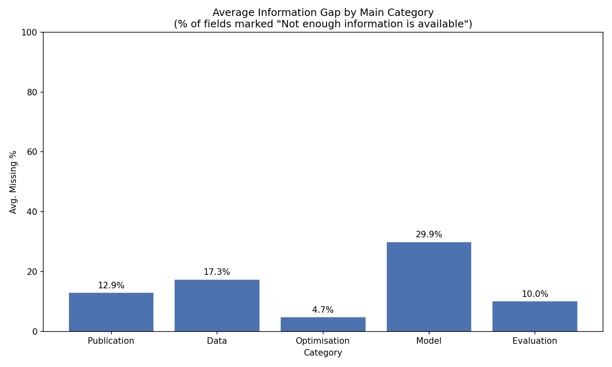
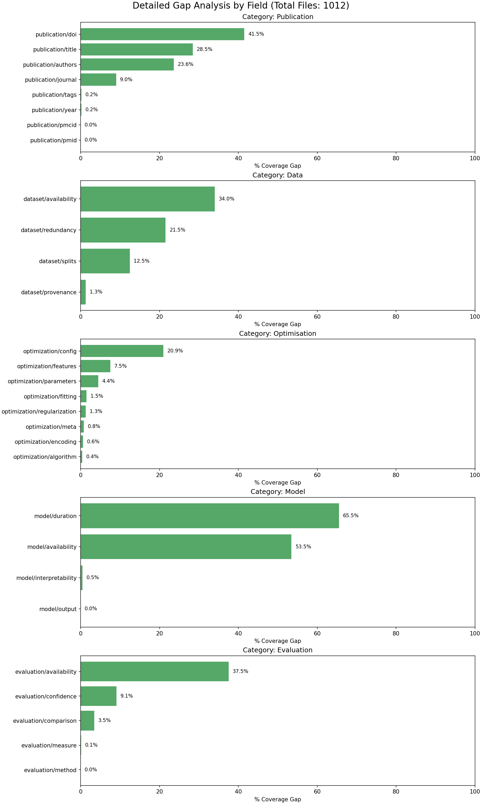

# Metadata Coverage Analysis Report
**Date:** 2026-01-15_15-27-46
**Dataset:** 1012 JSON files from `Copilot_1000_v0_Processed_2026-01-15`
**Target Phrase:** "Not enough information is available..."

## 1. Executive Summary
The following chart shows the average percentage of fields marked as 'Not enough information is available' within each main category.

## 2. Category Statistics
| Category | Avg Missing % | Max Missing Field | Min Missing Field |
|---|---|---|---|
| **Publication** | 12.9% | publication/doi (41.5%) | publication/pmcid (0.0%) |
| **Data** | 17.3% | dataset/availability (34.0%) | dataset/provenance (1.3%) |
| **Optimisation** | 4.7% | optimization/config (20.9%) | optimization/algorithm (0.4%) |
| **Model** | 29.9% | model/duration (65.5%) | model/output (0.0%) |
| **Evaluation** | 10.0% | evaluation/availability (37.5%) | evaluation/method (0.0%) |

## 3. Detailed Field Breakdown

### Full Data Table
| Category | Field | Missing Count | Missing % |
|---|---|---|---|
| Data | dataset/availability | 344 | 34.0% |
| Data | dataset/redundancy | 218 | 21.5% |
| Data | dataset/splits | 126 | 12.5% |
| Data | dataset/provenance | 13 | 1.3% |
| Evaluation | evaluation/availability | 380 | 37.5% |
| Evaluation | evaluation/confidence | 92 | 9.1% |
| Evaluation | evaluation/comparison | 35 | 3.5% |
| Evaluation | evaluation/measure | 1 | 0.1% |
| Evaluation | evaluation/method | 0 | 0.0% |
| Model | model/duration | 663 | 65.5% |
| Model | model/availability | 541 | 53.5% |
| Model | model/interpretability | 5 | 0.5% |
| Model | model/output | 0 | 0.0% |
| Optimisation | optimization/config | 212 | 20.9% |
| Optimisation | optimization/features | 76 | 7.5% |
| Optimisation | optimization/parameters | 45 | 4.4% |
| Optimisation | optimization/fitting | 15 | 1.5% |
| Optimisation | optimization/regularization | 13 | 1.3% |
| Optimisation | optimization/meta | 8 | 0.8% |
| Optimisation | optimization/encoding | 6 | 0.6% |
| Optimisation | optimization/algorithm | 4 | 0.4% |
| Publication | publication/doi | 420 | 41.5% |
| Publication | publication/title | 288 | 28.5% |
| Publication | publication/authors | 239 | 23.6% |
| Publication | publication/journal | 91 | 9.0% |
| Publication | publication/tags | 2 | 0.2% |
| Publication | publication/year | 2 | 0.2% |
| Publication | publication/pmcid | 0 | 0.0% |
| Publication | publication/pmid | 0 | 0.0% |
