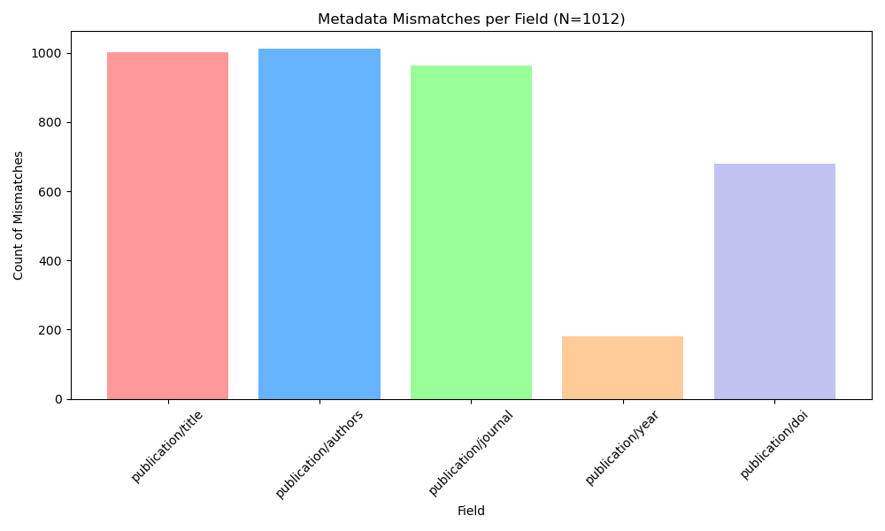
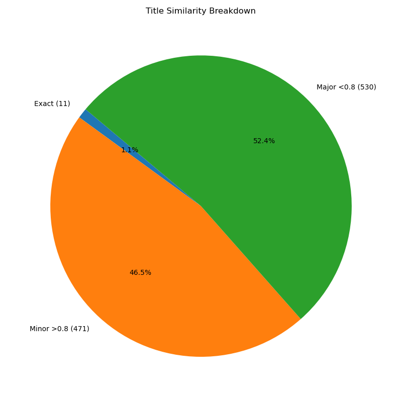

# Metadata Analysis Report
**Date:** 2026-01-15_15-18-53

**Source JSON Folder:** `Copilot_1000_v0_Processed_2026-01-15`
**Source TSV:** `Positive_PMC_TSV_Files/positive_entries_status.tsv`
**Total Files Scanned:** 1012
**Files Matched to TSV:** 1012

## 1. Field Mismatch Summary
| Field | Mismatches | %
|---|---|---|
| publication/title | 1001 | 98.9% |
| publication/authors | 1012 | 100.0% |
| publication/journal | 964 | 95.3% |
| publication/year | 180 | 17.8% |
| publication/doi | 679 | 67.1% |

## 2. Title Similarity Breakdown
- **Exact Matches:** 11
- **Case-only Differences:** 0
- **Minor Differences (>80%):** 471
- **Major Differences (<80%):** 530

## 3. Major Title Differences (Low Similarity)
| PMCID | JSON Title | TSV Title | Similarity |
|---|---|---|---|
| PMC4407517 | Applying Machine Learning Techniques in Detecting Bacterial Vaginosis | APPLYING MACHINE LEARNING TECHNIQUES IN DETECTING BACTERIAL VAGINOSIS. | 0.20 |
| PMC9347213 | Not enough information is available. | End-to-End Deep Learning Model to Predict and Design Secondary Structure Content of Structural Proteins. | 0.10 |
| PMC11865635 | Automatic Gallbladder Identification on CT | Automated CT image prescription of the gallbladder using deep learning: Development, evaluation, and health promotion. | 0.41 |
| PMC11806858 | Cardiovascular risk prediction in Chinese patients with type 2 diabetes mellitus using a machine learning-based dynamic prediction model | Predicting cardiovascular outcomes in Chinese patients with type 2 diabetes by combining risk factor trajectories and machine learning algorithm: a cohort study. | 0.57 |
| PMC11874791 | Fluids and Barriers of the CNS | Applying machine learning to high-dimensional proteomics datasets for the identification of Alzheimer's disease biomarkers. | 0.21 |
| PMC10583101 | Not enough information is available. | Performance of predictive algorithms in estimating the risk of being a zero-dose child in India, Mali and Nigeria. | 0.28 |
| PMC8897225 | Not enough information is available. | Classifying hazardous movements and loads during manual materials handling using accelerometers and instrumented insoles. | 0.25 |
| PMC9413214 | Not enough information is available. | Using Machine Learning to Identify Biomarkers Affecting Fat Deposition in Pigs by Integrating Multisource Transcriptome Information. | 0.24 |
| PMC7676934 | Not enough information is available. | Construction and Validation of Predictive Model to Identify Critical Genes Associated with Advanced Kidney Disease. | 0.23 |
| PMC7511449 | Not enough information is available. | Combining Three-Dimensional Modeling with Artificial Intelligence to Increase Specificity and Precision in Peptide-MHC Binding Predictions. | 0.22 |
| PMC10492341 | Gaucher disease identification using machine learning algorithms in electronic health records | Development of a rare disease algorithm to identify persons at risk of Gaucher disease using electronic health records in the United States. | 0.40 |
| PMC10075196 | Not enough information is available. | Early ACLR and Risk and Timing of Secondary Meniscal Injury Compared With Delayed ACLR or Nonoperative Treatment: A Time-to-Event Analysis Using Machine Learning. | 0.18 |
| PMC8586384 | Not enough information is available. | Knee Implant Identification by Fine-Tuning Deep Learning Models. | 0.30 |
| PMC10812839 | Not enough information is available. | Predicting Neuromuscular Engagement to Improve Gait Training with a Robotic Ankle Exoskeleton. | 0.15 |
| PMC4527478 | An Online Paradigm for Ovarian Cancer Screening | GyneScan: an improved online paradigm for screening of ovarian cancer via tissue characterization. | 0.39 |
| PMC10579490 | PRESCRIP-TEC: Prevention and Screening Innovation Project Towards Elimination of Cervical Cancer | Artificial intelligence and visual inspection in cervical cancer screening. | 0.23 |
| PMC10651383 | AI in Prediction of GISTs on EUS | Artificial Intelligence in the Prediction of Gastrointestinal Stromal Tumors on Endoscopic Ultrasonography Images: Development, Validation and Comparison with Endosonographers. | 0.29 |
| PMC8298161 | Not enough information is available. | Use of Deep-Learning Genomics to Discriminate Healthy Individuals from Those with Alzheimer's Disease or Mild Cognitive Impairment. | 0.22 |
| PMC6062245 | Not enough information is available. | <i>In silico</i> prediction of chemical genotoxicity using machine learning methods and structural alerts. | 0.27 |
| PMC6637411 | Not enough information is available. | Predictors of ccf-mtDNA reactivity to acute psychological stress identified using machine learning classifiers: A proof-of-concept. | 0.19 |
| PMC11607304 | Quantitative Expression of Latent Disease Factors | Quantitative Expression of Latent Disease Factors in Individuals Associated with Psychopathology Dimensions and Treatment Response. | 0.54 |
| PMC8058982 | Prognostic models for 1-year mortality in traumatic brain injury patients undergoing decompressive craniectomy: a machine learning-based approach. | Death after discharge: prognostic model of 1-year mortality in traumatic brain injury patients undergoing decompressive craniectomy. | 0.77 |
| PMC8352151 | Not enough information is available. | An Automated Lightweight Deep Neural Network for Diagnosis of COVID-19 from Chest X-ray Images. | 0.27 |
| PMC10069559 | Not enough information is available. | Predicting Hospitalization among Medicaid Home- and Community-Based Services Users Using Machine Learning Methods. | 0.24 |
| PMC11080251 | Prediction of New-Onset Osteoporotic Vertebral Compression Fractures After Percutaneous Vertebroplasty Using Machine Learning Algorithms | Predicting osteoporotic fractures post-vertebroplasty: a machine learning approach with a web-based calculator. | 0.55 |
| PMC11726131 | Not enough information is available. | Development of a spontaneous preterm birth predictive model using a panel of serum protein biomarkers for early pregnant women: A nested case-control study. | 0.16 |
| PMC11845296 | Not enough information is available. | Combinatorial mapping of E3 ubiquitin ligases to their target substrates. | 0.17 |
| PMC8080676 | Not enough information is available | Practical prediction model of the clinical response to programmed death-ligand 1 inhibitors in advanced gastric cancer. | 0.23 |
| PMC10878338 | Not enough information is available. | Machine learning-based prediction of in-hospital mortality for critically ill patients with sepsis-associated acute kidney injury. | 0.20 |
| PMC8455450 | Not enough information is available. | Improving Outcome Predictions for Patients Receiving Mechanical Circulatory Support by Optimizing Imputation of Missing Values. | 0.25 |
| PMC9588865 | 人工智能在锥形束计算机断层扫描影像中识别慢性根尖周炎根尖区病变的应用 | Use and performance of artificial intelligence applications in the diagnosis of chronic apical periodontitis based on cone beam computed tomography imaging. | 0.00 |
| PMC6216033 | Not enough information is available. | BERMP: a cross-species classifier for predicting m6A sites by integrating a deep learning algorithm and a random forest approach. | 0.17 |
| PMC10290467 | Not enough information is available. | Using Natural Language Processing and Machine Learning to Identify Opioids in Electronic Health Record Data. | 0.22 |
| PMC11075076 | Not enough information is available. | Radiomics analysis for prediction and classification of submucosal tumors based on gastrointestinal endoscopic ultrasonography. | 0.26 |
| PMC11781752 | Adaptive Brain Strain and Strain Rate Estimators for Traumatic Brain Injury Detection Using Domain Adaptation | Adaptive Machine Learning Head Model Across Different Head Impact Types Using Unsupervised Domain Adaptation and Generative Adversarial Networks. | 0.43 |
| PMC11148103 | Not enough information is available | SOFB is a comprehensive ensemble deep learning approach for elucidating and characterizing protein-nucleic-acid-binding residues. | 0.11 |
| PMC8246604 | 25(OH)D and functional outcomes in older adults | Sex-specific 25-hydroxyvitamin D threshold concentrations for functional outcomes in older adults: PRoject on Optimal VItamin D in Older adults (PROVIDO). | 0.42 |
| PMC7285934 | Not enough information is available. | Stereo-crossed ablation guided by stereoelectroencephalography for epilepsy: comprehensive coagulations <i>via</i> a network of multi-electrodes. | 0.19 |
| PMC8546707 | Predicting Drift of Influenza A Virus in Swine | Machine Learning Prediction and Experimental Validation of Antigenic Drift in H3 Influenza A Viruses in Swine. | 0.56 |
| PMC7422516 | Not enough information is available. | An automatic nuclei segmentation method based on deep convolutional neural networks for histopathology images. | 0.23 |
| PMC7540586 | WGS and Machine Learning in Source Attribution | Application of Whole-Genome Sequences and Machine Learning in Source Attribution of Salmonella Typhimurium. | 0.60 |
| PMC7406302 | Not enough information is available. | Deep neural network analyses of spirometry for structural phenotyping of chronic obstructive pulmonary disease. | 0.29 |
| PMC7249423 | Not enough information is available. | Microenvironment characterization and multi-omics signatures related to prognosis and immunotherapy response of hepatocellular carcinoma. | 0.22 |
| PMC8374469 | Not enough information is available. | Automatic classification of white regions in liver biopsies by supervised machine learning. | 0.30 |
| PMC9353566 | Machine learning diabetes prediction models | Development of Various Diabetes Prediction Models Using Machine Learning Techniques. | 0.46 |
| PMC10587874 | Heart dose prediction by machine learning for selecting patients not requiring deep inspiration breath-hold | Evaluation of the accuracy of heart dose prediction by machine learning for selecting patients not requiring deep inspiration breath‑hold radiotherapy after breast cancer surgery. | 0.73 |
| PMC2857954 | The analysis of corticosteroid-binding globulin activity of steroids. | Identification of Metabotropic Glutamate Receptor Subtype 5 Potentiators Using Virtual High-Throughput Screening. | 0.26 |
| PMC11789348 | Univariate and multivariate analyses of clinical and ultrasonic characteristics | Establishing a radiomics model using contrast-enhanced ultrasound for preoperative prediction of neoplastic gallbladder polyps exceeding 10 mm. | 0.30 |
| PMC8423361 | Serum CXCL1 discriminates active tuberculosis from latent tuberculosis infection and non-tuberculous lung disease | CXCL1: A new diagnostic biomarker for human tuberculosis discovered using Diversity Outbred mice. | 0.36 |
| PMC8457453 | Expanding HIV transmission network reconstruction | Incorporating metadata in HIV transmission network reconstruction: A machine learning feasibility assessment. | 0.57 |
| PMC9293610 | HCC risk prediction models in patients with CHB infection reported to date | The best predictive model for hepatocellular carcinoma in patients with chronic hepatitis B infection. | 0.52 |
| PMC11806126 | Voice Analysis for Perinatal Mental Health Screening | Voice analysis and deep learning for detecting mental disorders in pregnant women: a cross-sectional study. | 0.40 |
| PMC11552361 | Not enough information is available. | The utility of wearable electroencephalography combined with behavioral measures to establish a practical multi-domain model for facilitating the diagnosis of young children with attention-deficit/hyperactivity disorder. | 0.02 |
| PMC8982795 | Not enough information is available. | Detecting Adverse Drug Reactions on Twitter with Convolutional Neural Networks and Word Embedding Features. | 0.27 |
| PMC10127088 | m5U-SVM: a multi-view feature-based predictor for identifying RNA 5-methyluridine modification sites | m5U-SVM: identification of RNA 5-methyluridine modification sites based on multi-view features of physicochemical features and distributed representation. | 0.45 |
| PMC10423541 | Not enough information is available. | Screening of normal endoscopic large bowel biopsies with interpretable graph learning: a retrospective study. | 0.23 |
| PMC10836572 | Machine Learning-Based Classification of Parkinson’s Disease | Machine Learning-Based Classification of Parkinson's Disease Patients Using Speech Biomarkers. | 0.77 |
| PMC11504323 | Not enough information is available. | A Novel Prediction Method for Glaucoma Detection Using Retinographies. | 0.28 |
| PMC6842709 | Not enough information is available. | Machine Learning For Tuning, Selection, And Ensemble Of Multiple Risk Scores For Predicting Type 2 Diabetes. | 0.21 |
| PMC10842950 | Not enough information is available. | Deep Learning to Optimize Magnetic Resonance Imaging Prediction of Motor Outcomes After Hypoxic-Ischemic Encephalopathy. | 0.23 |
| PMC11278897 | Not enough information is available. | Autophagic signaling promotes systems-wide remodeling in skeletal muscle upon oncometabolic stress by D2-HG. | 0.25 |
| PMC8631067 | Interface radiomics to predict brain invasion in meningioma | Extensive peritumoral edema and brain-to-tumor interface MRI features enable prediction of brain invasion in meningioma: development and validation. | 0.47 |
| PMC11764147 | DGIL-6: A Graph Neural Network-Based Tool for Predicting IL-6-Inducing Peptides Using 3D Structural Information | IL-6-Inducing Peptide Prediction Based on 3D Structure and Graph Neural Network. | 0.27 |
| PMC6371636 | Not enough information is available. | A Novel LSSVM Based Algorithm to Increase Accuracy of Bacterial Growth Modeling. | 0.19 |
| PMC11509873 | Cardiovascular Risk Factors as Predictors of Diabetic Retinopathy in Patients with Type 2 Diabetes Mellitus | Cardiovascular Risk Factors as Independent Predictors of Diabetic Retinopathy in Type II Diabetes Mellitus: The Development of a Predictive Model. | 0.73 |
| PMC11739212 | Not enough information is available. | PhenoMATRIX™ for the screening of Group B Streptococcus (GBS) carriage in pregnant women: ready to get rid of the LIM broth? | 0.14 |
| PMC9388181 | Deep Learning Model-Assisted Detection | Deep learning model-assisted detection of kidney stones on computed tomography. | 0.58 |
| PMC10192934 | Not enough information is available. | A paradigm for high-throughput screening of cell-selective surfaces coupling orthogonal gradients and machine learning-based cell recognition. | 0.21 |
| PMC11841140 | Predictive Model for Compassion Fatigue Among Nursing Students Using Machine Learning and SHAP Analysis | Establishment and validation of a prediction model for compassion fatigue in nursing students. | 0.51 |
| PMC11616316 | Not enough information is available. | Image analysis-based identification of high risk ER-positive, HER2-negative breast cancers. | 0.31 |
| PMC9813835 | Prediction of urinary tract infection | Machine learning-assisted ensemble analysis for the prediction of urinary tract infection in elderly patients with ovarian cancer after cytoreductive surgery. | 0.37 |
| PMC6897314 | Not enough information is available. | Machine Learning Approach for Predicting Past Environmental Exposures From Molecular Profiling of Post-Exposure Human Serum Samples. | 0.18 |
| PMC11923905 | Not enough information is available. | Leveraging Network Target Theory for Efficient Prediction of Drug-Disease Interactions: A Transfer Learning Approach. | 0.30 |
| PMC8914522 | External Validation of Prediction Platforms for Clinically Relevant Postoperative Pancreatic Fistula After Pancreatoduodenectomy | External validation of risk prediction platforms for pancreatic fistula after pancreatoduodenectomy using nomograms and artificial intelligence. | 0.65 |
| PMC9847512 | Not enough information is available. | Classification and mutation prediction from non-small cell lung cancer histopathology images using deep learning. | 0.21 |
| PMC11519251 | Not enough information is available. | A radiomics-based interpretable machine learning model to predict the HER2 status in bladder cancer: a multicenter study. | 0.15 |
| PMC10637405 | Image Segmentation of Operative Neuroanatomy | Image Segmentation of Operative Neuroanatomy Into Tissue Categories Using a Machine Learning Construct and Its Role in Neurosurgical Training. | 0.47 |
| PMC10359547 | Not enough information is available. | Prediction of short-term atrial fibrillation risk using primary care electronic health records. | 0.32 |
| PMC8113686 | Psychology in Predicting Cardiovascular Disease | Roles of Anxiety and Depression in Predicting Cardiovascular Disease Among Patients With Type 2 Diabetes Mellitus: A Machine Learning Approach. | 0.43 |
| PMC9234342 | Not enough information is available. | Resting-state functional connectivity identifies individuals and predicts age in 8-to-26-month-olds. | 0.25 |
| PMC6864056 | Not enough information is available. | Application of convolutional neural networks to breast biopsies to delineate tissue correlates of mammographic breast density. | 0.19 |
| PMC4368063 | Not enough information is available | A sampling-based method for ranking protein structural models by integrating multiple scores and features. | 0.24 |
| PMC11907562 | Personalising Antidepressant Treatment for Unipolar Depression Combining Individual Choices, Risks and big Data: The PETRUSHKA Tool | Personalising Antidepressant Treatment for Unipolar Depression Combining Individual Choices, Risks and big Data: The PETRUSHKA Tool: Personnalisation du traitement antidépresseur de la dépression unipolaire associant choix individuels, risques et mégadonnées: l'outil PETRUSHKA. | 0.64 |
| PMC6224513 | Mitochondria Autosegmentation by 3D Network | Automatic Mitochondria Segmentation for EM Data Using a 3D Supervised Convolutional Network. | 0.53 |
| PMC10331222 | Not enough information is available. | Prediction of Foot Ulcers Using Artificial Intelligence for Diabetic Patients at Cairo University Hospital, Egypt. | 0.20 |
| PMC10742204 | Exploration 2023, 3, 20230028 | Early monitoring-to-warning Internet of Things system for emerging infectious diseases via networking of light-triggered point-of-care testing devices. | 0.13 |
| PMC5283391 | Not enough information is available. | A Deep Convolutional Neural Network for segmenting and classifying epithelial and stromal regions in histopathological images. | 0.19 |
| PMC11316486 | Pragmatic and Observational Research | A Real-World Study on the Short-Term Efficacy of Amlodipine in Treating Hypertension Among Inpatients. | 0.20 |
| PMC10628771 | Not enough information is available. | Development of a prediction model for the acquisition of extended spectrum beta-lactam-resistant organisms in U.S. international travellers. | 0.26 |
| PMC8976128 | Identification of risk factors for skeletal-related events following denosumab discontinuation in patients with bone metastasis | Risk factors associated with skeletal-related events following discontinuation of denosumab treatment among patients with bone metastases from solid tumors: A real-world machine learning approach. | 0.59 |
| PMC8991968 | Not enough information is available. | Multi-omics data integration analysis identifies the spliceosome as a key regulator of DNA double-strand break repair. | 0.30 |
| PMC6486931 | Not enough information is available. | Automatic segmentation and classification of breast lesions through identification of informative multiparametric PET/MRI features. | 0.28 |
| PMC11451058 | BMC Musculoskeletal Disorders | External validation of an artificial intelligence multi-label deep learning model capable of ankle fracture classification. | 0.14 |
| PMC7499912 | Radiomics signature and clinical factors-based nomogram for predicting cirrhosis in patients with chronic hepatitis B | A radiomics-based model on non-contrast CT for predicting cirrhosis: make the most of image data. | 0.48 |
| PMC5932308 | Deep Learning Predicts Renal Survival | Association of Pathological Fibrosis With Renal Survival Using Deep Neural Networks. | 0.35 |
| PMC8752652 | Visual Computing for Industry, Biomedicine, and Art | Comparative analysis of proficiencies of various textures and geometric features in breast mass classification using k-nearest neighbor. | 0.24 |
| PMC6450221 | Connectome Correlates of Auditory Over-Responsivity | White Matter Connectome Correlates of Auditory Over-Responsivity: Edge Density Imaging and Machine-Learning Classifiers. | 0.60 |
| PMC11795234 | LUAD prognostic model based on KEAP1/NRF2/HO‑1 mutation‑mediated upregulated genes | Construction of a lung adenocarcinoma prognostic model based on KEAP1/NRF2/HO‑1 mutation‑mediated upregulated genes and bioinformatic analysis. | 0.69 |
| PMC10591370 | Not enough information is available. | Prediction of Oncomelania hupensis distribution in association with climate change using machine learning models. | 0.31 |
| PMC7597463 | Not enough information is available. | Combining structural and textural assessments of volumetric FDG-PET uptake in NSCLC. | 0.20 |
| PMC11890425 | Not enough information is available. | Computed Tomography-Based Radiomics and Genomics Analyses for Survival Prediction of Stage III Unresectable Non-Small Cell Lung Cancer Treated With Definitive Chemoradiotherapy and Immunotherapy. | 0.20 |
| PMC9449110 | X-Ray-Based Fracture Prediction Model Using Deep Learning | Development of a Spine X-Ray-Based Fracture Prediction Model Using a Deep Learning Algorithm. | 0.76 |
| PMC10560153 | Not enough information is available. | AI-predicted mpMRI image features for the prediction of clinically significant prostate cancer. | 0.29 |
| PMC8273821 | Not enough information is available. | Application of deep learning to predict advanced neoplasia using big clinical data in colorectal cancer screening of asymptomatic adults. | 0.21 |
| PMC4002729 | A genetic algorithm optimized support vector machine model for the identification of agonists and antagonists of the 5-HT1A receptor | Classification of 5-HT(1A) receptor agonists and antagonists using GA-SVM method. | 0.41 |
| PMC11693621 | Not enough information is available. | Deciphering Necroptosis-Associated Molecular Subtypes in Acute Ischemic Stroke Through Bioinformatics and Machine Learning Analysis. | 0.32 |
| PMC9438026 | Early COVID-19 Respiratory Risk Stratification (ECoRRS) score for predicting intubation within 48 hours. | Early COVID-19 respiratory risk stratification using machine learning. | 0.64 |
| PMC10700043 | Not enough information is available. | Nomogram Based on Super-Resolution Ultrasound Images Outperforms in Predicting Benign and Malignant Breast Lesions. | 0.26 |
| PMC9953018 | Radiomic Analysis of FDG PET-CT for the Diagnosis of Active Aortitis | An Automated Method for Artifical Intelligence Assisted Diagnosis of Active Aortitis Using Radiomic Analysis of FDG PET-CT Images. | 0.35 |
| PMC7137462 | Using Machine Learning to Model Length of Stay | Predicting Inpatient Length of Stay After Brain Tumor Surgery: Developing Machine Learning Ensembles to Improve Predictive Performance. | 0.33 |
| PMC8756170 | Not enough information is available. | Fake or real news about COVID-19? Pretrained transformer model to detect potential misleading news. | 0.27 |
| PMC8355460 | Microbiome Data in Cystic Fibrosis | Microbiome Data Enhances Predictive Models of Lung Function in People With Cystic Fibrosis. | 0.54 |
| PMC7317941 | Not enough information is available. | LEAP: Using machine learning to support variant classification in a clinical setting. | 0.31 |
| PMC10896941 | Diagnosing and grading gastric atrophy and intestinal metaplasia using semi-supervised deep learning | Diagnosing and grading gastric atrophy and intestinal metaplasia using semi-supervised deep learning on pathological images: development and validation study. | 0.78 |
| PMC11147825 | Not enough information is available. | Machine learning-based pathomics signature of histology slides as a novel prognostic indicator in primary central nervous system lymphoma. | 0.23 |
| PMC9294765 | Not enough information is available. | A Deep Learning and Handcrafted Based Computationally Intelligent Technique for Effective COVID-19 Detection from X-ray/CT-scan Imaging. | 0.23 |
| PMC3205469 | Not enough information is available | Rapid and accurate developmental stage recognition of C. elegans from high-throughput image data. | 0.24 |
| PMC7659408 | Complex & Intelligent Systems | A novel hand-crafted with deep learning features based fusion model for COVID-19 diagnosis and classification using chest X-ray images. | 0.17 |
| PMC11018039 | Not enough information is available. | Hybrid statistical and machine learning modeling of cognitive neuroscience data. | 0.21 |
| PMC10098758 | Bicyclane biomarkers in fish adipose tissue as forensic fingerprints of dietary oil exposure | Fish Fingerprinting: Identifying Crude Oil Pollutants using Bicyclic Sesquiterpanes (Bicyclanes) in the Tissues of Exposed Fish. | 0.22 |
| PMC9608344 | Ensemble learning for multiple sclerosis disability estimation using brain structural connectivity | Classification of multiple sclerosis clinical profiles using machine learning and grey matter connectome. | 0.49 |
| PMC9142346 | Not enough information is available. | An AI-based Decision Support System for Predicting Mental Health Disorders. | 0.22 |
| PMC11230954 | Not enough information is available. | Pathomic model based on histopathological features and machine learning to predict IDO1 status and its association with breast cancer prognosis. | 0.18 |
| PMC11904180 | Not enough information is available. | Deep learning models in classifying primary bone tumors and bone infections based on radiographs. | 0.29 |
| PMC10854473 | Robust Class Decomposition for Alzheimer's Progression Detection | A robust class decomposition-based approach for detecting Alzheimer's progression. | 0.68 |
| PMC8006383 | Not enough information is available. | Deep learning-based six-type classifier for lung cancer and mimics from histopathological whole slide images: a retrospective study. | 0.18 |
| PMC9840815 | Not enough information is available. | Role of different types of RNA molecules in the severity prediction of SARS-CoV-2 patients. | 0.28 |
| PMC10641561 | Not enough information is available. | Integrated virtual screening, molecular modeling and machine learning approaches revealed potential natural inhibitors for epilepsy. | 0.19 |
| PMC7099856 | Volume-Independent Automated Ejection Fraction | Automated Echocardiographic Quantification of Left Ventricular Ejection Fraction Without Volume Measurements Using a Machine Learning Algorithm Mimicking a Human Expert. | 0.25 |
| PMC10959883 | Insights into Imaging | Deep learning-based 3D cerebrovascular segmentation workflow on bright and black blood sequences magnetic resonance angiography. | 0.19 |
| PMC10509314 | Not enough information is available. | Forecasting Risk of Future Rapid Glaucoma Worsening Using Early Visual Field, OCT, and Clinical Data. | 0.18 |
| PMC11406433 | Predicting fatty liver disease by artificial neural network | Laboratory variables-based artificial neural network models for predicting fatty liver disease: A retrospective study. | 0.41 |
| PMC5622501 | Predictive modeling of placental malaria using multiple malarial antigens | Statistical prediction of immunity to placental malaria based on multi-assay antibody data for malarial antigens. | 0.61 |
| PMC11229738 | Not enough information is available. | Comprehensive assessment of machine learning methods for diagnosing gastrointestinal diseases through whole metagenome sequencing data. | 0.19 |
| PMC8081115 | Dietary Factors and Incident Cardiovascular Disease: A Prospective Analysis | Association Between Coffee Intake and Incident Heart Failure Risk: A Machine Learning Analysis of the FHS, the ARIC Study, and the CHS. | 0.39 |
| PMC9968666 | A machine learning approach to predicting the issuance of stay-at-home orders during the initial wave of COVID-19 in African countries | Predicting the issuance of COVID-19 stay-at-home orders in Africa: Using machine learning to develop insight for health policy research. | 0.48 |
| PMC11097606 | Not enough information is available. | Predicting Language Function Post-Stroke: A Model-Based Structural Connectivity Approach. | 0.21 |
| PMC7668301 | Not enough information is available. | High incidence of glucocorticoid-induced hyperglycaemia in inflammatory bowel disease: metabolic and clinical predictors identified by machine learning. | 0.23 |
| PMC8690000 | COVID-19 Detection by Machine Learning | Detection of COVID-19 by Machine Learning Using Routine Laboratory Tests. | 0.52 |
| PMC8845488 | Lung mass density analysis using deep neural network and lung ultrasound surface wave elastography. | Predicting lung mass density of patients with interstitial lung disease and healthy subjects using deep neural network and lung ultrasound surface wave elastography. | 0.73 |
| PMC8514185 | Machine Learning in HIV | Cohort-Derived Machine Learning Models for Individual Prediction of Chronic Kidney Disease in People Living With Human Immunodeficiency Virus: A Prospective Multicenter Cohort Study. | 0.22 |
| PMC7605344 | Antimicrobial Resistance and Infection Control | Risk prediction models to guide antibiotic prescribing: a study on adult patients with uncomplicated upper respiratory tract infections in an emergency department. | 0.20 |
| PMC10071555 | Predicting future falls in older people using NLP of clinical notes | Predicting future falls in older people using natural language processing of general practitioners' clinical notes. | 0.70 |
| PMC11829134 | Developing Deep Learning Model for MPNs Pathology | Development and validation of a deep learning model for morphological assessment of myeloproliferative neoplasms using clinical data and digital pathology. | 0.40 |
| PMC11679129 | Drug Repurposing for Tuberculosis Treatment: Identification of FDA-Approved Drugs Targeting GyrA and PknB | Identification of Anti-Tuberculosis Drugs Targeting DNA Gyrase A and Serine/Threonine Protein Kinase PknB: A Machine Learning-Assisted Drug-Repurposing Approach. | 0.39 |
| PMC8192262 | Diagnostic performance of StandardTM Q COVID-19 Ag test in symptomatic and asymptomatic subjects with different viral loads | Diagnostic performance of rapid antigen test for COVID-19 and the effect of viral load, sampling time, subject's clinical and laboratory parameters on test accuracy. | 0.43 |
| PMC10043063 | Not enough information is available. | Automatic Lung Cancer Segmentation in [18F]FDG PET/CT Using a Two-Stage Deep Learning Approach. | 0.27 |
| PMC6293604 | Epigenetic prediction of HIV frailty using ensemble learning of DNA methylation data | Machine learning selected smoking-associated DNA methylation signatures that predict HIV prognosis and mortality. | 0.36 |
| PMC11791183 | Not enough information is available. | A toolkit for quantifying individual response to herbal extracts in metabolic and inflammatory stress. | 0.28 |
| PMC8665129 | Not enough information is available. | Unified framework for early stage status prediction of autism based on infant structural magnetic resonance imaging. | 0.26 |
| PMC9560533 | Comparison Labels for Neural Network Training | Improved Training Efficiency for Retinopathy of Prematurity Deep Learning Models Using Comparison versus Class Labels. | 0.21 |
| PMC10270711 | Brain network multiclass characterization of frontotemporal dementias | Multiclass characterization of frontotemporal dementia variants via multimodal brain network computational inference. | 0.58 |
| PMC10476493 | GeNetOntology: A Gene Set Mining Tool for Gene Expression Data | GeNetOntology: identifying affected gene ontology terms via grouping, scoring, and modeling of gene expression data utilizing biological knowledge-based machine learning. | 0.41 |
| PMC7115906 | A CNN-aided method to predict glaucoma progression using DARC | A CNN-aided method to predict glaucoma progression using DARC (Detection of Apoptosing Retinal Cells). | 0.75 |
| PMC11324570 | Not enough information is available. | Comprehensive ethological analysis of fear expression in rats using DeepLabCut and SimBA machine learning model. | 0.28 |
| PMC11700395 | Two-step transfer learning framework for predicting drug response in glioblastoma multiforme patient-derived cell cultures | Two-Step Transfer Learning Improves Deep Learning-Based Drug Response Prediction in Small Datasets: A Case Study of Glioblastoma. | 0.46 |
| PMC11870305 | Genotype and environment interaction of C. bungei | Growth adaptability and stability in <i>Catalpa bungei</i> clones: the role of genetics and environment. | 0.27 |
| PMC9420706 | Not enough information is available | An easy numeric data augmentation method for early-stage COVID-19 tweets exploration of participatory dynamics of public attention and news coverage. | 0.23 |
| PMC7723216 | Not enough information is available. | Robust data-driven identification of risk factors and their interactions: A simulation and a study of parental and demographic risk factors for schizophrenia. | 0.27 |
| PMC8326176 | Not enough information is available. | Development of Novel Artificial Intelligence to Detect the Presence of Clinically Meaningful Coronary Atherosclerotic Stenosis in Major Branch from Coronary Angiography Video. | 0.19 |
| PMC9532264 | "Economic Burden of Chronic Rhinosinusitis With Nasal Polyps: A Machine Learning Approach to Identify Patient Subgroups" | Profiling Disease and Economic Burden in CRSwNP Using Machine Learning. | 0.41 |
| PMC10951698 | Automated Detection and Classification of Modic Changes from MRI Images Using Deep Learning | Comparing image normalization techniques in an end-to-end model for automated modic changes classification from MRI images. | 0.39 |
| PMC3259434 | Not enough information is available. | Feature-based classifiers for somatic mutation detection in tumour-normal paired sequencing data. | 0.32 |
| PMC8966003 | Identify Klebsiella pneumoniae by Raman spectroscopy | Identification of antibiotic resistance and virulence-encoding factors in Klebsiella pneumoniae by Raman spectroscopy and deep learning. | 0.54 |
| PMC7988437 | Not enough information is available | High-content, label-free analysis of proplatelet production from megakaryocytes. | 0.19 |
| PMC10293340 | Automatic quantification of fetal volume and weight from 3D MRI using deep learning | Automatic Segmentation of the Fetus in 3D Magnetic Resonance Images Using Deep Learning: Accurate and Fast Fetal Volume Quantification for Clinical Use. | 0.26 |
| PMC11503583 | Not enough information is available. | Identifying factors associated with locomotive syndrome using machine learning methods: The third survey of the research on osteoarthritis/osteoporosis against disability study. | 0.21 |
| PMC10627450 | Machine Learning Models for Predicting Home Interstage Mortality in Patients with Single Ventricle Heart Disease | Machine Learning to Predict Interstage Mortality Following Single Ventricle Palliation: A NPC-QIC Database Analysis. | 0.66 |
| PMC8258057 | Not enough information is available. | Random forest approach for determining risk prediction and predictive factors of type 2 diabetes: large-scale health check-up data in Japan. | 0.23 |
| PMC9883648 | Not enough information is available. | [Development and validation of an automatic diagnostic tool for lumbar stability based on deep learning]. | 0.30 |
| PMC11417445 | Predicting OTC antibiotic use in India | Predicting over-the-counter antibiotic use in rural Pune, India, using machine learning methods. | 0.52 |
| PMC8331277 | Not enough information is available. | Identification of Prognostic Genes in Neuroblastoma in Children by Weighted Gene Coexpression Network Analysis. | 0.18 |
| PMC9836197 | Machine Learning Prediction of Treatment Outcomes for Pharmacotherapy in Body Dysmorphic Disorder | Predictors of pharmacotherapy outcomes for body dysmorphic disorder: a machine learning approach. | 0.51 |
| PMC11006770 | Not enough information is available. | Supporting the decision to perform molecular profiling for cancer patients based on routinely collected data through the use of machine learning. | 0.18 |
| PMC7874964 | Not enough information is available | Using handpicked features in conjunction with ResNet-50 for improved detection of COVID-19 from chest X-ray images. | 0.23 |
| PMC10711801 | Feature-wise Transformations for Prostate Cancer Segmentation in Multiparametric MRI | INTEGRATING PROSTATE SPECIFIC ANTIGEN DENSITY BIOMARKER INTO DEEP LEARNING PROSTATE MRI LESION SEGMENTATION MODELS. | 0.12 |
| PMC9015002 | Not enough information is available. | Gaming behavior and brain activation using functional near-infrared spectroscopy, Iowa gambling task, and machine learning techniques. | 0.22 |
| PMC10010318 | Not enough information is available. | Brain Neural Progenitors are New Predictive Biomarkers for Breast Cancer Hormonotherapy. | 0.24 |
| PMC3698244 | Not enough information is available. | Classification algorithms for predicting sleepiness and sleep apnea severity. | 0.27 |
| PMC11590401 | Not enough information is available. | Identification and optimization of relevant factors for chronic kidney disease in abdominal obesity patients by machine learning methods: insights from NHANES 2005-2018. | 0.20 |
| PMC8212763 | Not enough information is available. | 2021 update to HIV-TRePS: a highly flexible and accurate system for the prediction of treatment response from incomplete baseline information in different healthcare settings. | 0.22 |
| PMC11246586 | Not enough information is available. | An ensemble deep learning models approach using image analysis for cotton crop classification in AI-enabled smart agriculture. | 0.30 |
| PMC11215191 | Not enough information is available. | Machine learning natural language processing for identifying venous thromboembolism: systematic review and meta-analysis. | 0.23 |
| PMC8596733 | Not enough information is available. | Extending approximate Bayesian computation with supervised machine learning to infer demographic history from genetic polymorphisms using DIYABC Random Forest. | 0.22 |
| PMC8209373 | Machine Learning for Atrial Fibrillation Cases in Hypertrophic Cardiomyopathy | Machine Learning Methods for Identifying Atrial Fibrillation Cases and Their Predictors in Patients With Hypertrophic Cardiomyopathy: The HCM-AF-Risk Model. | 0.66 |
| PMC8753945 | Not enough information is available. | DeepCov19Net: Automated COVID-19 Disease Detection with a Robust and Effective Technique Deep Learning Approach. | 0.23 |
| PMC8580864 | Spatial and Spatio-temporal Epidemiology 40 (2022) 100471 | Spatio-temporal modeling of COVID-19 prevalence and mortality using artificial neural network algorithms. | 0.30 |
| PMC11556849 | FFKC Detection Using AI | Forme fruste keratoconus detection with OCT corneal topography using artificial intelligence algorithms. | 0.25 |
| PMC9935764 | Deep Learning-Based Artificial Intelligence for Micromanipulation Techniques in Assisted Reproductive Technology | Advancements in the future of automating micromanipulation techniques in the IVF laboratory using deep convolutional neural networks. | 0.42 |
| PMC6510616 | Not enough information is available. | Along-axon diameter variation and axonal orientation dispersion revealed with 3D electron microscopy: implications for quantifying brain white matter microstructure with histology and diffusion MRI. | 0.14 |
| PMC10052279 | Not enough information is available | Local attention and long-distance interaction of rPPG for deepfake detection. | 0.27 |
| PMC9149237 | Prediction Models for Respiratory Diseases | Machine Learning Models for Predicting the Occurrence of Respiratory Diseases Using Climatic and Air-Pollution Factors. | 0.43 |
| PMC8170065 | Network Modeling Analysis in Health Informatics and Bioinformatics | A hybrid feature selection model based on improved squirrel search algorithm and rank aggregation using fuzzy techniques for biomedical data classification. | 0.29 |
| PMC11850780 | Brain, Behavior, & Immunity - Health 44 (2025) 100957 | Evaluation of machine learning models for the prediction of Alzheimer's: In search of the best performance. | 0.24 |
| PMC10365090 | Not enough information is available | Radiomics combined with transcriptomics to predict response to immunotherapy from patients treated with PD-1/PD-L1 inhibitors for advanced NSCLC. | 0.19 |
| PMC11417923 | Not enough information is available. | Diabetic Retinopathy Features Segmentation without Coding Experience with Computer Vision Models YOLOv8 and YOLOv9. | 0.23 |
| PMC10256890 | Not enough information is available. | Classification of Lapses in Smokers Attempting to Stop: A Supervised Machine Learning Approach Using Data From a Popular Smoking Cessation Smartphone App. | 0.17 |
| PMC8591832 | Gut microbiota composition predicts severity of Mycobacterium avium subspecies paratuberculosis shedding in dairy cows | Classification and prediction of Mycobacterium Avium subsp. Paratuberculosis (MAP) shedding severity in cattle based on young stock heifer faecal microbiota composition using random forest algorithms. | 0.19 |
| PMC9297869 | Not enough information is available. | Acute Graft-Versus-Host Disease After Orthotopic Liver Transplantation: Predicting This Rare Complication Using Machine Learning. | 0.28 |
| PMC10891085 | Not enough information is available. | Multi-scale V-net architecture with deep feature CRF layers for brain extraction. | 0.26 |
| PMC11612356 | Current Research in Food Science 9 (2024) 100929 | Skin hyperspectral imaging and machine learning to accurately predict the muscular poly-unsaturated fatty acids contents in fish. | 0.14 |
| PMC4470375 | A Support Vector Machine-Based Approach to Identify Key Biomarkers of Sensitization Using a Co-Culture System of RealSkin and MUTZ-LCs | Predicting full thickness skin sensitization using a support vector machine. | 0.39 |
| PMC9128253 | Automated identification of autism spectrum disorder phenotypes from electronic health records using natural language processing and machine learning | Development of a phenotype ontology for autism spectrum disorder by natural language processing on electronic health records. | 0.53 |
| PMC8336249 | Facial recognition technology for genetic syndromes identification: a comparison between VGG-16 model and paediatricians | Genetic syndromes screening by facial recognition technology: VGG-16 screening model construction and evaluation. | 0.45 |
| PMC11308548 | MICROPHERRET: A machine learning tool for predicting microbial functional traits from genome annotations | MICROPHERRET: MICRObial PHEnotypic tRait ClassifieR using Machine lEarning Techniques. | 0.36 |
| PMC4786027 | Not enough information is available. | Datamining approaches for modeling tumor control probability. | 0.31 |
| PMC6992687 | Not enough information is available | Individual-patient prediction of meningioma malignancy and survival using the Surveillance, Epidemiology, and End Results database. | 0.19 |
| PMC11293250 | Not enough information is available. | In silico insights into the design of novel NR2B-selective NMDA receptor antagonists: QSAR modeling, ADME-toxicity predictions, molecular docking, and molecular dynamics investigations. | 0.14 |
| PMC11404758 | Deep Learning Detection of MR | High-Throughput Deep Learning Detection of Mitral Regurgitation. | 0.62 |
| PMC9842515 | Not enough information is available. | Development and Validation of Coding Algorithms to Identify Patients with Incident Non-Small Cell Lung Cancer in United States Healthcare Claims Data. | 0.22 |
| PMC8975993 | Not enough information is available. | Multi-modality machine learning predicting Parkinson's disease. | 0.34 |
| PMC4751423 | Clinical Prediction Models for Sleep Apnea | Clinical Prediction Models for Sleep Apnea: The Importance of Medical History over Symptoms. | 0.63 |
| PMC7646998 | Not enough information is available. | Using electronic health records to identify candidates for human immunodeficiency virus pre-exposure prophylaxis: An application of super learning to risk prediction when the outcome is rare. | 0.20 |
| PMC11543471 | Machine Learning-Based Prediction of Lipid Profiles in Supercritical Fluid Extraction from Microalgae Galdieria sp. USBA-GBX-832 | Predicting the microalgae lipid profile obtained by supercritical fluid extraction using a machine learning model. | 0.50 |
| PMC9573904 | Machine Learning-Based Prediction of Suicidal Ideation and Suicide Planning or Attempt in the Korean Population | Machine learning prediction of suicidal ideation, planning, and attempt among Korean adults: A population-based study. | 0.69 |
| PMC6150970 | Machine learning algorithms for identifying travel modes using accelerometer and GPS data | An open-source tool to identify active travel from hip-worn accelerometer, GPS and GIS data. | 0.59 |
| PMC11490577 | Deep learning-based prediction of breast cancer recurrence risk using whole-slide images and clinicopathologic features | A multi-model approach integrating whole-slide imaging and clinicopathologic features to predict breast cancer recurrence risk. | 0.48 |
| PMC4955649 | Multivariate profiles of impulsivity and related constructs in heroin and amphetamine dependence | Machine-learning identifies substance-specific behavioral markers for opiate and stimulant dependence. | 0.30 |
| PMC11460743 | Volumetric and textural analysis of PET/CT in DLBCL | Volumetric and textural analysis of PET/CT in patients with diffuse large B-cell lymphoma highlights the importance of novel MTVrate feature. | 0.49 |
| PMC11227463 | Clinical and Experimental Medicine (2024) 24:152 | Deciphering glutamine metabolism patterns for malignancy and tumor microenvironment in clear cell renal cell carcinoma. | 0.28 |
| PMC10073367 | [18F]FDG PET/CT radiomics models for predicting EGFR mutation status in lung adenocarcinoma | The predictive value of [18F]FDG PET/CT radiomics combined with clinical features for EGFR mutation status in different clinical staging of lung adenocarcinoma. | 0.60 |
| PMC5130110 | Anatomical Transcription-based Legend from Analysis of Single-cell RNA-Sequencing (ATLAS-seq) | Transcriptomic Profiling Maps Anatomically Patterned Subpopulations among Single Embryonic Cardiac Cells. | 0.32 |
| PMC7280067 | Patient Preference and Adherence | Applying Machine Learning Models to Predict Medication Nonadherence in Crohn's Disease Maintenance Therapy. | 0.26 |
| PMC8812126 | Not enough information is available. | An efficient hardware architecture based on an ensemble of deep learning models for COVID -19 prediction. | 0.23 |
| PMC5796779 | Not enough information is available. | Improved clinical trial enrollment criterion to identify patients with diabetes at risk of end-stage renal disease. | 0.29 |
| PMC10067239 | Metabolic profiling of aqueous humor in macular edema of different etiologies | Metabolomic analysis of aqueous humor reveals potential metabolite biomarkers for differential detection of macular edema. | 0.45 |
| PMC8601010 | Clinical Mass Spectrometry | A proposal for score assignment to characterize biological processes from mass spectral analysis of serum. | 0.29 |
| PMC11334056 | Not enough information is available. | Disease2Vec: Encoding Alzheimer's progression via disease embedding tree. | 0.28 |
| PMC11631021 | Renal IRI Subtypes and Predictive Model Based on PCD-Related Genes | Identification of Renal Ischemia-Reperfusion Injury Subtypes and Predictive Model for Graft Loss after Kidney Transplantation Based on Programmed Cell Death-Related Genes. | 0.56 |
| PMC10900714 | INFLAMeR: A Machine Learning-Based Approach for Identifying lncRNAs Involved in Inflammation and Myeloid Differentiation | Integration of transcription regulation and functional genomic data reveals lncRNA SNHG6's role in hematopoietic differentiation and leukemia. | 0.29 |
| PMC11099321 | Exploring the relationship between smartphone usage features and insomnia symptoms using machine learning | The predictive value of supervised machine learning models for insomnia symptoms through smartphone usage behavior. | 0.40 |
| PMC10996401 | Brain Functional Network Feature Extraction Based on DTF and Graph Theory for MI-EEG Data Classification | A brain functional network feature extraction method based on directed transfer function and graph theory for MI-BCI decoding tasks. | 0.64 |
| PMC7648592 | Deep learning methods for visualization of heterogeneity | Optimization of deep learning methods for visualization of tumor heterogeneity and brain tumor grading through digital pathology. | 0.59 |
| PMC11476512 | Not enough information is available. | Differential diagnosis of congenital ventricular septal defect and atrial septal defect in children using deep learning-based analysis of chest radiographs. | 0.17 |
| PMC8142481 | Intelligent prediction model for post-traumatic blood transfusion demand | Intelligent prediction of RBC demand in trauma patients using decision tree methods. | 0.41 |
| PMC7310396 | Estimating Prolonged Opioid Use After ACL Reconstruction | Can Predictive Modeling Tools Identify Patients at High Risk of Prolonged Opioid Use After ACL Reconstruction? | 0.64 |
| PMC9461546 | Prediction of outpatient visits and expenditure using a random forest algorithm in a middle-income country | Prediction of outpatient visits and expenditure under the Universal Coverage Scheme in Bangkok using subscriber's attributes: A random forest analysis. | 0.57 |
| PMC11464570 | Not enough information is available. | Shaping tomorrow's support: baseline clinical characteristics predict later social functioning and quality of life in schizophrenia spectrum disorder. | 0.17 |
| PMC8350610 | Internet Interventions 25 (2021) 100424 | Predicting acute suicidal ideation on Instagram using ensemble machine learning models. | 0.19 |
| PMC8711640 | Not enough information is available. | Data-efficient and weakly supervised computational pathology on whole-slide images. | 0.24 |
| PMC7101259 | Not enough information is available. | Validation of an alcohol misuse classifier in hospitalized patients. | 0.29 |
| PMC7711119 | Not enough information is available. | Applying Artificial Intelligence for Diagnostic Classification of Korean Autism Spectrum Disorder. | 0.30 |
| PMC3710575 | Not enough information is available. | Prediction of lung tumor types based on protein attributes by machine learning algorithms. | 0.25 |
| PMC7561562 | Using machine learning to assess the predictive potential of standardized nursing data for… | Using machine learning to assess the predictive potential of standardized nursing data for home healthcare case-mix classification. | 0.78 |
| PMC11070644 | Not enough information is available. | Prediction of breast cancer and axillary positive-node response to neoadjuvant chemotherapy based on multi-parametric magnetic resonance imaging radiomics models. | 0.12 |
| PMC11912617 | TransGeneSelector: A Robust Tool for Key Gene Mining in Small Sample Transcriptomic Datasets | TransGeneSelector: using a transformer approach to mine key genes from small transcriptomic datasets in plant responses to various environments. | 0.46 |
| PMC11474110 | CDORPF: An Integrated Data Optimization and Risk Prediction Framework for Microbiome Data | Comprehensive data optimization and risk prediction framework: machine learning methods for inflammatory bowel disease prediction based on the human gut microbiome data. | 0.49 |
| PMC9977388 | Not enough information is available. | Towards automated in vivo parcellation of the human cerebral cortex using supervised classification of magnetic resonance fingerprinting residuals. | 0.23 |
| PMC10374349 | Artificial intelligence for diagnosing neoplastic biliary lesions during digital single-operator cholangioscopy | Artificial intelligence for diagnosing neoplasia on digital cholangioscopy: development and multicenter validation of a convolutional neural network model. | 0.56 |
| PMC11849444 | Noninvasive Prediction of Microvascular Invasion in Hepatocellular Carcinoma Using Topological Convolutional Neural Networks | MRI-Based Topology Deep Learning Model for Noninvasive Prediction of Microvascular Invasion and Assisting Prognostic Stratification in HCC. | 0.42 |
| PMC7537153 | COVID-19 Drug Discovery and Pandemic Preparedness | Viral pandemic preparedness: A pluripotent stem cell-based machine-learning platform for simulating SARS-CoV-2 infection to enable drug discovery and repurposing. | 0.25 |
| PMC9041159 | Interdisciplinary Perspectives on Infectious Diseases | Prediction of COVID-19 Pandemic in Bangladesh: Dual Application of Susceptible-Infective-Recovered (SIR) and Machine Learning Approach. | 0.27 |
| PMC8722581 | Not enough information is available. | Predicting primary outcomes of brain tumor patients with advanced neuroimaging MRI measures. | 0.34 |
| PMC8654111 | Not enough information is available. | A machine learning approach for classifying and quantifying acoustic diversity. | 0.26 |
| PMC11235401 | Not enough information is available. | Optimal computed tomography-based biomarkers for prediction of incisional hernia formation. | 0.30 |
| PMC9746351 | Not enough information is available. | Gut metagenome-derived signature predicts hepatic decompensation and mortality in NAFLD-related cirrhosis. | 0.25 |
| PMC10869931 | Not enough information is available. | Uncovering hub genes and immunological characteristics for heart failure utilizing RRA, WGCNA and Machine learning. | 0.26 |
| PMC11430310 | Improved Beluga Whale Optimization Algorithm with Chaotic Mapping, Double Opposition-Based Learning, Elite Position Strategy, and Step-Adaptive Levy Flight Strategy | MSBWO: A Multi-Strategies Improved Beluga Whale Optimization Algorithm for Feature Selection. | 0.41 |
| PMC10268549 | Not enough information is available. | Predicting Domestic Abuse (Fairly) and Police Risk Assessment. | 0.14 |
| PMC9931490 | Not enough information is available. | Identification of Pyroptosis-Relevant Signature in Tumor Immune Microenvironment and Prognosis in Skin Cutaneous Melanoma Using Network Analysis. | 0.20 |
| PMC10052246 | Race-Specific Behavioral Health Needs and Strengths of Asian Americans in Publicly Funded Behavioral Health Services | Predicting the Behavioral Health Needs of Asian Americans in Public Mental Health Treatment: A Classification Tree Approach. | 0.60 |
| PMC7821214 | Not enough information is available | Bruise dating using deep learning. | 0.29 |
| PMC11319202 | Not enough information is available. | Unsupervised representation learning on high-dimensional clinical data improves genomic discovery and prediction. | 0.20 |
| PMC10497895 | Radiomic analysis in sepsis | Radiomic analysis of abdominal organs during sepsis of digestive origin in a French intensive care unit. | 0.41 |
| PMC4879664 | Novel verbal fluency scores and structural brain imaging measures for predicting conversion from mild cognitive impairment to Alzheimer’s disease | Novel verbal fluency scores and structural brain imaging for prediction of cognitive outcome in mild cognitive impairment. | 0.79 |
| PMC8269970 | Machine Learning to Predict Transplant Outcomes: Helpful or Hype? | Machine learning to predict transplant outcomes: helpful or hype? A national cohort study. | 0.76 |
| PMC9505703 | Not enough information is available. | Predicting Age-Related Macular Degeneration Progression with Contrastive Attention and Time-Aware LSTM. | 0.26 |
| PMC9925947 | Machine learning-based prediction of amorphous solid dispersion formation and chemical stability during hot-melt extrusion | The applications of machine learning to predict the forming of chemically stable amorphous solid dispersions prepared by hot-melt extrusion. | 0.62 |
| PMC11654828 | Not enough information is available. | Fine-grained Patient Similarity Measuring using Contrastive Graph Similarity Networks. | 0.25 |
| PMC8288051 | Deep learning models for decoding eye-tracking data during visual tasks | Convolutional neural networks can decode eye movement data: A black box approach to predicting task from eye movements. | 0.34 |
| PMC10785655 | Not enough information is available | Integrating unsupervised and supervised learning techniques to predict traumatic brain injury: A population-based study. | 0.19 |
| PMC8757162 | Inteligência artificial na doença coronariana | Validation of an Artificial Intelligence Algorithm for Diagnostic Prediction of Coronary Disease: Comparison with a Traditional Statistical Model. | 0.32 |
| PMC5526294 | Not enough information is available. | Discovery and validation of a colorectal cancer classifier in a new blood test with improved performance for high-risk subjects. | 0.21 |
| PMC9188460 | Long-time prediction of arrhythmic cardiac action potentials using recurrent neural networks and reservoir computing | A machine-learning approach for long-term prediction of experimental cardiac action potential time series using an autoencoder and echo state networks. | 0.51 |
| PMC8678829 | Not enough information is available. | Detection of abnormal left ventricular geometry in patients without cardiovascular disease through machine learning: An ECG-based approach. | 0.24 |
| PMC9386205 | Not enough information is available. | Machine learning models for non-invasive glucose measurement: towards diabetes management in smart healthcare. | 0.23 |
| PMC6416075 | Not enough information is available. | Application of deep convolutional neural networks in classification of protein subcellular localization with microscopy images. | 0.21 |
| PMC11849712 | Not enough information is available. | Development of Machine Learning Models for Predicting the 1-Year Risk of Reoperation After Lower Limb Oncological Resection and Endoprosthetic Reconstruction Based on Data From the PARITY Trial. | 0.21 |
| PMC11436411 | Reinforcement Learning of Sperm Chemotaxis in 2D and 3D | Reinforcement learning of biomimetic navigation: a model problem for sperm chemotaxis. | 0.55 |
| PMC11329411 | Micronutrient Intake Patterns and Iron Deficiency Anemia Among Young Healthy Female University Students in Palestine | Identification and prediction of association patterns between nutrient intake and anemia using machine learning techniques: results from a cross-sectional study with university female students from Palestine. | 0.06 |
| PMC10770810 | Not enough information is available. | Prediction of breath-holding spells based on electrocardiographic parameters using machine-learning model. | 0.20 |
| PMC9889147 | Stem Cells International | Identification of the Hub Genes Involved in Stem Cell Treatment for Intervertebral Disc Degeneration: A Conjoint Analysis of Single-Cell and Machine Learning. | 0.25 |
| PMC11261530 | Identification of key biomarkers and potential therapeutic targets in osteoarthritis through bioinformatics analysis | Identification of biomarkers related to tryptophan metabolism in osteoarthritis. | 0.55 |
| PMC11882137 | Not enough information is available. | Optimizing Automated Hematoma Expansion Classification from Baseline and Follow-Up Head Computed Tomography. | 0.22 |
| PMC7982771 | Prognostic value of autophagy-related genes in uveal melanoma | An autophagy-related prognostic signature associated with immune microenvironment features of uveal melanoma. | 0.48 |
| PMC10284593 | Genotypic and Phenotypic Mapping of PRRSV ORF-5 Region to Clinical Signs in Ontario Sow Herds Using Machine Learning Approaches | Classification of porcine reproductive and respiratory syndrome clinical impact in Ontario sow herds using machine learning approaches. | 0.55 |
| PMC9086604 | Not enough information is available | Predicting lying, sitting and walking at different intensities using smartphone accelerometers at three different wear locations: hands, pant pockets, backpack. | 0.21 |
| PMC10926267 | Not enough information is available. | Semisupervised transfer learning for evaluation of model classification performance. | 0.33 |
| PMC9837969 | Molecular Autism | Profiles of autism characteristics in thirteen genetic syndromes: a machine learning approach. | 0.16 |
| PMC7991821 | Testicular sperm identification via CNN | A preliminary study of sperm identification in microdissection testicular sperm extraction samples with deep convolutional neural networks. | 0.34 |
| PMC11747270 | Not enough information is available. | A data-driven machine learning algorithm to predict the effectiveness of inulin intervention against type II diabetes. | 0.29 |
| PMC11130007 | Not enough information is available. | Complemental Value of Microstructural and Macrostructural MRI in the Discrimination of Neurodegenerative Parkinson Syndromes. | 0.26 |
| PMC6440667 | Metabolic Syndrome Prediction Model | Metabolic Syndrome Prediction Using Machine Learning Models with Genetic and Clinical Information from a Nonobese Healthy Population. | 0.42 |
| PMC10662376 | Not enough information is available. | Identification of Potential Genes and Critical Pathways in Postoperative Recurrence of Crohn's Disease by Machine Learning And WGCNA Network Analysis. | 0.20 |
| PMC11620855 | Radiomics-Based Prediction of Vertebral Fracture Risk: Integration of Imaging and Clinical Features | Integrating radiomics with clinical data for enhanced prediction of vertebral fracture risk. | 0.47 |
| PMC10583839 | Latent-Graph Learning for Disease Prediction with Interpretable Attention Module | IA-GCN: Interpretable Attention based Graph Convolutional Network for Disease Prediction. | 0.34 |
| PMC2731080 | Not enough information is available. | Identification of protein functions using a machine-learning approach based on sequence-derived properties. | 0.27 |
| PMC6938222 | Scan-specific Robust Artificial-neural-networks for k-space Interpolation-based (RAKI) Reconstruction: Database-free Deep Learning for Fast Imaging | Fast GPU Implementation of a Scan-Specific Deep Learning Reconstruction for Accelerated Magnetic Resonance Imaging. | 0.36 |
| PMC11762205 | Not enough information is available. | A comprehensive analysis of stroke risk factors and development of a predictive model using machine learning approaches. | 0.23 |
| PMC10409381 | 基于深度学习的结直肠癌全视野数字病理切片分子分型识别研究 | [Identifying Molecular Subtypes of Whole-Slide Image in Colorectal Cancer via Deep Learning]. | 0.00 |
| PMC9938619 | Not enough information is available. | Predicting gene knockout effects from expression data. | 0.31 |
| PMC5266630 | Not enough information is available. | Machine learning approaches to personalize early prediction of asthma exacerbations. | 0.27 |
| PMC1421405 | Not enough information is available. | Identification of Enterobacter sakazakii from closely related species: the use of artificial neural networks in the analysis of biochemical and 16S rDNA data. | 0.18 |
| PMC10450242 | Not enough information is available. | The Role of Levodopa Challenge in Predicting the Outcome of Subthalamic Deep Brain Stimulation. | 0.26 |
| PMC8867103 | Automatic Labeling & Ordering of Brain Activity Maps | An Approach to Automatically Label and Order Brain Activity/Component Maps. | 0.66 |
| PMC11666702 | Not enough information is available. | PET radiomics-based lymphovascular invasion prediction in lung cancer using multiple segmentation and multi-machine learning algorithms. | 0.24 |
| PMC9196053 | Deep learning to improve diagnosis of thyroid cancer | Improved diagnosis of thyroid cancer aided with deep learning applied to sonographic text reports: a retrospective, multi-cohort, diagnostic study. | 0.34 |
| PMC10438915 | Not enough information is available. | Control of Magnetic Surgical Robots With Model-Based Simulators and Reinforcement Learning. | 0.24 |
| PMC6387562 | Not enough information is available. | Emergency department triage prediction of clinical outcomes using machine learning models. | 0.29 |
| PMC9802238 | Not enough information is available. | Fluorescence lifetime image microscopy prediction with convolutional neural networks for cell detection and classification in tissues. | 0.25 |
| PMC3255105 | Not enough information is available. | Identification of Regional Lymph Node Involvement of Colorectal Cancer by Serum SELDI Proteomic Patterns. | 0.18 |
| PMC10875838 | Deep Learning-Assisted Keratograph 5M for Blinking Analysis in Dry Eye Disease | Comparison of deep learning-assisted blinking analysis system and Lipiview interferometer in dry eye patients: a cross-sectional study. | 0.47 |
| PMC9686141 | Not enough information is available. | Synergistic Approach of Interfacial Layer Engineering and READ-Voltage Optimization in HfO2-Based FeFETs for In-Memory-Computing Applications. | 0.20 |
| PMC10788551 | Machine Learning for ICH | Prediction Model for Unfavorable Outcome in Spontaneous Intracerebral Hemorrhage Based on Machine Learning. | 0.24 |
| PMC5624169 | Not enough information is available. | Can a Smartphone Diagnose Parkinson Disease? A Deep Neural Network Method and Telediagnosis System Implementation. | 0.16 |
| PMC10752691 | Not enough information is available. | Autism Spectrum Disorder Detection by Hybrid Convolutional Recurrent Neural Networks from Structural and Resting State Functional MRI Images. | 0.26 |
| PMC7148171 | Machine Learning Algorithms for Suicide Risk Identification in a Native American Community | Reaching Those at Highest Risk for Suicide: Development of a Model Using Machine Learning Methods for use With Native American Communities. | 0.48 |
| PMC10600209 | Cell Death Discovery (2023) 9:397 | Decoding the metastatic potential and optimal postoperative adjuvant therapy of melanoma based on metastasis score. | 0.15 |
| PMC6755632 | Not enough information is available. | Different models for prediction of radical cystectomy postoperative complications and care pathways. | 0.28 |
| PMC9125693 | Not enough information is available. | Dense Depth Estimation from Stereo Endoscopy Videos Using Unsupervised Optical Flow Methods. | 0.31 |
| PMC10373320 | Diabetes risk prediction model based on large-scale health examination data in Xinjiang, China | Machine learning for predicting diabetes risk in western China adults. | 0.28 |
| PMC11180436 | Not enough information is available. | Explainable Deep Learning Model for Predicting Serious Adverse Events in Hospitalized Geriatric Patients Within 72 Hours. | 0.09 |
| PMC9525754 | Not enough information is available. | Neighboring Algorithm for Visual Semantic Analysis toward GAN-Generated Pictures. | 0.38 |
| PMC11097004 | Not enough information is available. | Identifying animal behaviours from accelerometers: Improving predictive accuracy of machine learning by refining the variables selected, data frequency, and sample duration. | 0.15 |
| PMC10046420 | Not enough information is available | A fair and interpretable network for clinical risk prediction: a regularized multi-view multi-task learning approach. | 0.25 |
| PMC8790173 | EEG Classification Reveals tACS Aftereffects | Classification of EEG Signals Reveals a Focal Aftereffect of 10 Hz Motor Cortex Transcranial Alternating Current Stimulation. | 0.43 |
| PMC9789372 | Food pantry visits during the COVID-19 pandemic | Food insecurity and disasters: predicting disparities in total and first-time food pantry visits during the COVID-19 pandemic. | 0.54 |
| PMC6494740 | Not enough information is available. | QUANTITATIVE OPTICAL COHERENCE TOMOGRAPHY ANGIOGRAPHY FEATURES FOR OBJECTIVE CLASSIFICATION AND STAGING OF DIABETIC RETINOPATHY. | 0.07 |
| PMC3879284 | Soft-tissue chin strain during lip closure | The predictability of dentoskeletal factors for soft-tissue chin strain during lip closure. | 0.62 |
| PMC7689324 | In-line monitoring of pharmaceutical coating processes using convolutional neural networks and optical coherence tomography | Deep convolutional neural networks: Outperforming established algorithms in the evaluation of industrial optical coherence tomography (OCT) images of pharmaceutical coatings. | 0.44 |
| PMC10584300 | Artificial Intelligence to Predict Cirrhosis | Using Artificial Intelligence to Predict Cirrhosis From Computed Tomography Scans. | 0.70 |
| PMC6153696 | Not enough information is available. | Characterization of missing values in untargeted MS-based metabolomics data and evaluation of missing data handling strategies. | 0.25 |
| PMC10591351 | Performance of a deep learning-based approach in predicting the need for mechanical ventilation in neonates in the neonatal intensive care unit | Early prediction of need for invasive mechanical ventilation in the neonatal intensive care unit using artificial intelligence and electronic health records: a clinical study. | 0.51 |
| PMC9051300 | Not enough information is available. | [Clinical Study of Artificial Intelligence-assisted Diagnosis System in Predicting the 
Invasive Subtypes of Early-stage Lung Adenocarcinoma Appearing as Pulmonary Nodules]. | 0.17 |
| PMC11231460 | Not enough information is available. | Integrating fNIRS and machine learning: shedding light on Parkinson's disease detection. | 0.23 |
| PMC10147375 | Not enough information is available. | Rapid geographical source attribution of <i>Salmonella enterica</i> serovar Enteritidis genomes using hierarchical machine learning. | 0.24 |
| PMC2654973 | Not enough information is available. | Machine learning techniques to identify putative genes involved in nitrogen catabolite repression in the yeast Saccharomyces cerevisiae. | 0.27 |
| PMC10594409 | Not enough information is available. | Deductive automated pollen classification in environmental samples via exploratory deep learning and imaging flow cytometry. | 0.28 |
| PMC10976492 | Not enough information is available. | Development and Validation of a Machine Learning Prognostic Model of m5C Related immune Genes in Lung Adenocarcinoma. | 0.24 |
| PMC11701861 | Not enough information is available. | Cross-modal contrastive learning for unified placenta analysis using photographs. | 0.31 |
| PMC3163029 | Not enough information is available. | Prediction of B-cell linear epitopes with a combination of support vector machine classification and amino acid propensity identification. | 0.26 |
| PMC11140654 | Not enough information is available | Generalizing the Enhanced-Deep-Super-Resolution Neural Network to Brain MR Images: A Retrospective Study on the Cam-CAN Dataset. | 0.18 |
| PMC10281452 | 90-Day Acute Care Use Predictions for Immunotherapy Patients | Machine Learning Models Using Routinely Collected Clinical Data Offer Robust and Interpretable Predictions of 90-Day Unplanned Acute Care Use for Cancer Immunotherapy Patients. | 0.41 |
| PMC8155180 | Not enough information is available. | Deep convolutional neural networks based ECG beats classification to diagnose cardiovascular conditions. | 0.31 |
| PMC10700010 | Collaborative analysis on fruit disorder with AI and transcriptome | Transcriptomic Interpretation on Explainable AI-Guided Intuition Uncovers Premonitory Reactions of Disordering Fate in Persimmon Fruit. | 0.12 |
| PMC9637023 | Not enough information is available. | A convolutional neural network-based framework for analysis and assessment of non-linguistic sound classification and enhancement for normal hearing and cochlear implant listeners. | 0.19 |
| PMC8671660 | Not enough information is available. | Prediction of Postoperative Delirium in Geriatric Hip Fracture Patients: A Clinical Prediction Model Using Machine Learning Algorithms. | 0.18 |
| PMC7841422 | In Silico Prediction of Volume of Distribution in Humans | Predicting Volume of Distribution in Humans: Performance of In Silico Methods for a Large Set of Structurally Diverse Clinical Compounds. | 0.44 |
| PMC11525099 | Not enough information is available. | Role of Artificial intelligence model in prediction of low back pain using T2 weighted MRI of Lumbar spine. | 0.27 |
| PMC10239131 | Not enough information is available | Deep learning classification of uveal melanoma based on histopathological images and identification of a novel indicator for prognosis of patients. | 0.20 |
| PMC11850473 | Linear Machine Learning Models for Predicting Overall Survival in Glioblastoma Patients | Predictive modeling with linear machine learning can estimate glioblastoma survival in months based solely on MGMT-methylation status, age and sex. | 0.38 |
| PMC9561045 | Not enough information is available. | Prediction of drug-induced liver injury and cardiotoxicity using chemical structure and in vitro assay data. | 0.19 |
| PMC11503672 | Chemical & Biomedical Imaging | Enhancing Open-World Bacterial Raman Spectra Identification by Feature Regularization for Improved Resilience against Unknown Classes. | 0.22 |
| PMC10073265 | Comparative Performance of Regularized Regression and Machine Learning Approaches for Predicting Surveillance Mammography Outcomes | Performance of Statistical and Machine Learning Risk Prediction Models for Surveillance Benefits and Failures in Breast Cancer Survivors. | 0.50 |
| PMC9592196 | Not enough information is available. | A Machine Learning Applied Diagnosis Method for Subcutaneous Cyst by Ultrasonography. | 0.25 |
| PMC10807651 | Biomimetics 2023, 8, 313 | Diagnosis of Monkeypox Disease Using Transfer Learning and Binary Advanced Dipper Throated Optimization Algorithm. | 0.12 |
| PMC11851764 | Not enough information is available. | Treatment response of patients with tuberculosis and HIV co-infection: a retrospective analysis of secondary data from Shanghai, China, 2010-2020. | 0.24 |
| PMC9022904 | Not enough information is available. | Arrhythmic sudden death survival prediction using deep learning analysis of scarring in the heart. | 0.28 |
| PMC8106637 | Not enough information is available. | Identifying Urinary Tract Infection-Related Information in Home Care Nursing Notes. | 0.35 |
| PMC10473108 | Curation of PD-Patient Report of Problems | What Patients Say: Large-Scale Analyses of Replies to the Parkinson's Disease Patient Report of Problems (PD-PROP). | 0.46 |
| PMC7694891 | Not enough information is available. | Supervised Machine Learning Models for Prediction of COVID-19 Infection using Epidemiology Dataset. | 0.28 |
| PMC11008999 | Not enough information is available. | Applicable Machine Learning Model for Predicting Contrast-induced Nephropathy Based on Pre-catheterization Variables. | 0.25 |
| PMC4513962 | Not enough information is available. | What variables are important in predicting bovine viral diarrhea virus? A random forest approach. | 0.15 |
| PMC5814341 | Not enough information is available. | Predicting corticosteroid-free endoscopic remission with vedolizumab in ulcerative colitis. | 0.24 |
| PMC11866537 | Not enough information is available. | Information Extraction from Clinical Texts with Generative Pre-trained Transformer Models. | 0.32 |
| PMC11891141 | Not enough information is available. | Development of Machine-learning Model to Predict Anticoagulant Use and Type in Geriatric Traumatic Brain Injury Using Coagulation Parameters. | 0.21 |
| PMC10678814 | Skill levels classification models in conducting retraction using EEG features | Surgical skill level classification model development using EEG and eye-gaze data and machine learning algorithms. | 0.52 |
| PMC7731513 | Machine Learning and Finite Element Modeling to Predict Transcranial Direct Current Stimulation Response in Older Adults | Machine learning and individual variability in electric field characteristics predict tDCS treatment response. | 0.48 |
| PMC11804240 | A computational method to differentiate normal individuals, osteoarthritis and rheumatoid arthritis patients using serum biomarkers. | Development and Validation of a Cost-Effective Machine Learning Model for Screening Potential Rheumatoid Arthritis in Primary Healthcare Clinics. | 0.37 |
| PMC11305163 | Not enough information is available. | Does machine learning improve prediction of VA primary care reliance? | 0.36 |
| PMC5405381 | Not enough information is available. | Mass Spectrometry Profiling of HLA-Associated Peptidomes in Mono-allelic Cells Enables More Accurate Epitope Prediction. | 0.21 |
| PMC4958551 | Not enough information is available. | Use of machine learning to improve autism screening and diagnostic instruments: effectiveness, efficiency, and multi-instrument fusion. | 0.20 |
| PMC11764930 | Remote Biomimetic Pulse Reproduction System for Traditional Chinese Medicine | Research and development of the pulse acquisition system and the pulse biomimetic reproduction system. | 0.38 |
| PMC10004203 | Not enough information is available. | Intelligent medical image grouping through interactive learning. | 0.38 |
| PMC9586871 | Not enough information is available. | Multimodal integration of radiology, pathology and genomics for prediction of response to PD-(L)1 blockade in patients with non-small cell lung cancer. | 0.20 |
| PMC9088642 | Cardiometabolic Disease, Social Determinants of Health, and COVID-19 Outcomes | Associations between cardiometabolic disease severity, social determinants of health (SDoH), and poor COVID-19 outcomes. | 0.72 |
| PMC6139224 | Not enough information is available. | Integration of Genome-Wide DNA Methylation and Transcription Uncovered Aberrant Methylation-Regulated Genes and Pathways in the Peripheral Blood Mononuclear Cells of Systemic Sclerosis. | 0.18 |
| PMC10837709 | Not enough information is available. | Evaluation of information from artificial intelligence on rotator cuff repair surgery. | 0.36 |
| PMC6691572 | Radiomics Signature Based on Magnetic Resonance Imaging for Preoperative Prediction of Synchronous Lymph Node Metastasis in Patients With Pancreatic Ductal Adenocarcinoma | A radiomics approach based on support vector machine using MR images for preoperative lymph node status evaluation in intrahepatic cholangiocarcinoma. | 0.48 |
| PMC7713521 | Shape-Based Graph Convolutional Networks for Alzheimer’s Disease Diagnosis | Interpretation of Brain Morphology in Association to Alzheimer's Disease Dementia Classification Using Graph Convolutional Networks on Triangulated Meshes. | 0.37 |
| PMC10549471 | Addressing COVID-19 Vaccine Distrust among Black Patients: The LEAPS framework & Afrocentric approaches in Medical Education | Explainable Machine Learning Model to Predict COVID-19 Severity Among Older Adults in the Province of Quebec. | 0.33 |
| PMC11860222 | Prostate Cancer and Prostatic Diseases (2025) 28:94 – 102 | A non-invasive 25-Gene PLNM-Score urine test for detection of prostate cancer pelvic lymph node metastasis. | 0.26 |
| PMC11789630 | Not enough information is available. | Modeling gene interactions in polygenic prediction via geometric deep learning. | 0.35 |
| PMC11061038 | Not enough information is available. | Multiomics Blood-Based Biomarkers Predict Alzheimer's Predementia with High Specificity in a Multicentric Cohort Study. | 0.19 |
| PMC8113076 | Not enough information is available. | Astrocyte regional heterogeneity revealed through machine learning-based glial neuroanatomical assays. | 0.29 |
| PMC10283114 | Not enough information is available. | Timeline Registration for Electronic Health Records. | 0.32 |
| PMC8799451 | Not enough information is available. | A complete framework for accurate recognition and prognosis of COVID-19 patients based on deep transfer learning and feature classification approach. | 0.19 |
| PMC6309227 | Not enough information is available. | Multiple episodes of interbreeding between Neanderthal and modern humans. | 0.26 |
| PMC11423779 | Identifying Unmet Social Needs by NLP | Automated Identification of Patients' Unmet Social Needs in Clinical Text Using Natural Language Processing. | 0.46 |
| PMC11547247 | Platelet-RNA-based cancer detection | Improving platelet-RNA-based diagnostics: a comparative analysis of machine learning models for cancer detection and multiclass classification. | 0.38 |
| PMC9886331 | Not enough information is available. | AMSFMap Methodology to improve prediction accuracy of CNN model for Covid19 using X-ray images. | 0.29 |
| PMC5054094 | MicroRNA Precursor Identification | Identification of microRNA precursors with support vector machine and string kernel. | 0.24 |
| PMC11043154 | Not enough information is available. | Explainable AI for CHO cell culture media optimization and prediction of critical quality attribute. | 0.28 |
| PMC8002797 | Predicting stroke discharge destination | Pre-stroke disability and stroke severity as predictors of discharge destination from an acute stroke ward. | 0.49 |
| PMC10407326 | Not enough information is available. | Foot Pronation Prediction with Inertial Sensors during Running: A Preliminary Application of Data-Driven Approaches. | 0.24 |
| PMC10425526 | Mitochondria-induced necroptosis in intracranial aneurysms: a potential target for predictive diagnosis, targeted prevention, and personalized treatment | Comprehensive analysis of mitochondrial dysfunction and necroptosis in intracranial aneurysms from the perspective of predictive, preventative, and personalized  medicine. | 0.64 |
| PMC7906608 | Predicting LOS with Machine Learning | Adding Continuous Vital Sign Information to Static Clinical Data Improves the Prediction of Length of Stay After Intubation: A Data-Driven Machine Learning Approach. | 0.29 |
| PMC10757779 | Early Detection of High-Risk COPD Using Quantitative CT Measurements and Clinical Information | Early Diagnosis of High-Risk Chronic Obstructive Pulmonary Disease Based on Quantitative High-Resolution Computed Tomography Measurements. | 0.51 |
| PMC7689198 | Not enough information is available. | Machine Learning Analysis of Blood microRNA Data in Major Depression: A Case-Control Study for Biomarker Discovery. | 0.21 |
| PMC9611587 | IntegralVac: A Deep Learning-Based Predictor for Multi-Epitope Vaccine Design | IntegralVac: A Machine Learning-Based Comprehensive Multivalent Epitope Vaccine Design Method. | 0.74 |
| PMC11106606 | Nuclear grooves and artificial intelligence | Revisiting the utility of identifying nuclear grooves as unique nuclear changes by an object detector model. | 0.32 |
| PMC9089236 | Not enough information is available. | Surface values, volumetric measurements and radiomics of structural MRI for the diagnosis and subtyping of attention-deficit/hyperactivity disorder. | 0.23 |
| PMC11285060 | pKalculator: A pKa predictor for C–H bonds | pKalculator: A p<i>K</i> a predictor for C-H bonds. | 0.79 |
| PMC10564812 | Not enough information is available. | MLACNN: an attention mechanism-based CNN architecture for predicting genome-wide DNA methylation. | 0.21 |
| PMC8664800 | Not enough information is available. | A Cautionary Note on Predicting Social Judgments from Faces with Deep Neural Networks. | 0.25 |
| PMC8287547 | Not enough information is available. | Prediction of COVID-19 deterioration in high-risk patients at diagnosis: an early warning score for advanced COVID-19 developed by machine learning. | 0.24 |
| PMC9075456 | Arrhythmia Detection From Photoplethysmography | Multiclass Arrhythmia Detection and Classification From Photoplethysmography Signals Using a Deep Convolutional Neural Network. | 0.53 |
| PMC10372900 | Laparoscopic surgery in Mexico: a retrospective analysis of the Egresos Hospitalarios 2021 database | Availability of laparoscopic surgery in Mexico's public health system: a nationwide retrospective analysis. | 0.53 |
| PMC10356903 | Not enough information is available. | Graph Convolutional Neural Networks for Histologic Classification of Pancreatic Cancer. | 0.29 |
| PMC8011704 | Not enough information is available. | Machine Learning in Aging: An Example of Developing Prediction Models for Serious Fall Injury in Older Adults. | 0.30 |
| PMC10386986 | Not enough information is available. | Development of a deep pathomics score for predicting hepatocellular carcinoma recurrence after liver transplantation. | 0.21 |
| PMC8815306 | Machine learning models for preoperative prediction of length of stay after fast-track hip and knee arthroplasty | Machine learning classifiers do not improve prediction of hospitalization > 2 days after fast-track hip and knee arthroplasty compared with a classical statistical risk model. | 0.63 |
| PMC9978716 | Not enough information is available. | [Comparison of prediction ability of two extended Cox models in nonlinear survival data analysis]. | 0.18 |
| PMC10791584 | Not enough information is available | Single-cell spatial multi-omics and deep learning dissect enhancer-driven gene regulatory networks in liver zonation. | 0.20 |
| PMC5960433 | Not enough information is available. | Random forest based classification of alcohol dependence patients and healthy controls using resting state MRI. | 0.27 |
| PMC2998534 | Not enough information is available. | Predicting genome-wide redundancy using machine learning. | 0.37 |
| PMC6071933 | Not enough information is available. | Discovery of indoleamine 2,3-dioxygenase inhibitors using machine learning based virtual screening. | 0.24 |
| PMC7373365 | Not enough information is available. | Targeted Workup after Initial Febrile Urinary Tract Infection: Using a Novel Machine Learning Model to Identify Children Most Likely to Benefit from Voiding Cystourethrogram. | 0.18 |
| PMC11613066 | Machine learning for low back pain | Comparative analysis of machine learning models for efficient low back pain prediction using demographic and lifestyle factors. | 0.41 |
| PMC11683696 | Not enough information is available. | Deep Learning-Based Carotid Plaque Ultrasound Image Detection and Classification Study. | 0.29 |
| PMC11247394 | Not enough information is available. | Prediction of adolescent idiopathic scoliosis with machine learning algorithms using brain volumetric measurements. | 0.23 |
| PMC11647999 | Not enough information is available. | Identification of Ferroptosis-Related Gene in Age-Related Macular Degeneration Using Machine Learning. | 0.25 |
| PMC11606396 | Not enough information is available. | Analysis of the Predictors of Mortality from Ischemic Heart Diseases in the Southern Region of Brazil: A Geographic Machine-Learning-Based Study. | 0.22 |
| PMC10878443 | Identifying CAC Using CXRs and Machine Learning | Identifying Coronary Artery Calcification Using Chest X-ray Radiographs and Machine Learning: The Role of the Radiomics Score. | 0.54 |
| PMC6473411 | Social Determinants of Association Among Diabetes Mellitus, Visual Impairment and Hearing Loss in a Middle-Aged or Old Population: A Longitudinal Study Using an Artificial Neural Network | Social Determinants of Association among Diabetes Mellitus, Visual Impairment and Hearing Loss in a Middle-Aged or Old Population: Artificial-Neural-Network Analysis of the Korean Longitudinal Study of Aging (2014⁻2016). | 0.74 |
| PMC9724931 | AI and OCT for plaque characterisation | Artificial intelligence and optical coherence tomography for the automatic characterisation of human atherosclerotic plaques. | 0.37 |
| PMC7977789 | Distinguishing Myocardial Infarction from Myocarditis | Radiomics for Distinguishing Myocardial Infarction from Myocarditis at Late Gadolinium Enhancement at MRI: Comparison with Subjective Visual Analysis. | 0.52 |
| PMC10584742 | Not enough information is available. | Reduced Deep Convolutional Activation Features (R-DeCAF) in Histopathology Images to Improve the Classification Performance for Breast Cancer Diagnosis. | 0.20 |
| PMC11823220 | Not enough information is available. | Combining machine learning with external validation to explore necroptosis and immune response in moyamoya disease. | 0.29 |
| PMC11886321 | HF in the elderly | Developing a nomogram for postoperative delirium in elderly patients with hip fractures. | 0.21 |
| PMC8457832 | i31-GEP Algorithm for Sentinel Lymph Node Metastasis Prediction | Integrating 31-Gene Expression Profiling With Clinicopathologic Features to Optimize Cutaneous Melanoma Sentinel Lymph Node Metastasis Prediction. | 0.54 |
| PMC11366442 | Not enough information is available. | LDCNN: A new arrhythmia detection technique with ECG signals using a linear deep convolutional neural network. | 0.27 |
| PMC4789356 | Not enough information is available. | BacHbpred: Support Vector Machine Methods for the Prediction of Bacterial Hemoglobin-Like Proteins. | 0.28 |
| PMC11648505 | Not enough information is available. | Predictive model for genital tract infections among men and women in Ghana: An application of LASSO penalized cross-validation regression model. | 0.26 |
| PMC10826007 | Voice Features for Emotional Disorder Identification in Children and Adolescents | Differentiation between depression and bipolar disorder in child and adolescents by voice features. | 0.46 |
| PMC11029226 | A universal trauma-related detection algorithm for chest X-ray | Development and evaluation of a deep learning-based model for simultaneous detection and localization of rib and clavicle fractures in trauma patients' chest radiographs. | 0.33 |
| PMC10571406 | Automatic deep learning approach for measuring left ventricular outflow tract diameter in 2D transthoracic echocardiography | Deep learning for automated left ventricular outflow tract diameter measurements in 2D echocardiography. | 0.72 |
| PMC5362124 | Predictive Modeling of Hospital Readmission Rates Using Electronic Medical Record-Wide Machine Learning: A Case-Study Using Mount Sinai Heart Failure Cohort | PREDICTIVE MODELING OF HOSPITAL READMISSION RATES USING ELECTRONIC MEDICAL RECORD-WIDE MACHINE LEARNING: A CASE-STUDY USING MOUNT SINAI HEART FAILURE COHORT. | 0.27 |
| PMC7065628 | Not enough information is available. | Classifying T cell activity in autofluorescence intensity images with convolutional neural networks. | 0.24 |
| PMC10273194 | Not enough information is available. | Prediction-oriented prognostic biomarker discovery with survival machine learning methods. | 0.25 |
| PMC6538271 | Biomedical Image Processing with Containers and Deep Learning: An Automated Analysis Pipeline | Biomedical Image Processing with Containers and Deep Learning: An Automated Analysis Pipeline: Data architecture, artificial intelligence, automated processing, containerization, and clusters orchestration ease the transition from data acquisition to insights in medium-to-large datasets. | 0.49 |
| PMC9804041 | Not enough information is available. | Comparison of logistic regression and machine learning methods for predicting postoperative delirium in elderly patients: A retrospective study. | 0.21 |
| PMC10846766 | Not enough information is available. | Machine Learning to Predict the Need for Postmastectomy Radiotherapy after Immediate Breast Reconstruction. | 0.21 |
| PMC8164639 | Not enough information is available. | Predicting Posttraumatic Stress Disorder Among Survivors of Recent Interpersonal Violence. | 0.32 |
| PMC8786681 | Not enough information is available. | The Effectiveness of Machine Learning in Predicting Lateral Lymph Node Metastasis From Lower Rectal Cancer: A Single Center Development and Validation Study. | 0.19 |
| PMC11192659 | Not enough information is available. | Predicting community acquired bloodstream infection in infants using full blood count parameters and C-reactive protein; a machine learning study. | 0.26 |
| PMC6323839 | Species identification using g-spaced nucleotide pair composition and random forest classifier | funbarRF: DNA barcode-based fungal species prediction using multiclass Random Forest supervised learning model. | 0.39 |
| PMC9871862 | Not enough information is available. | Predicting ambient PM2.5 concentrations in Ulaanbaatar, Mongolia with machine learning approaches. | 0.23 |
| PMC2846370 | Not enough information is available | Learning accurate and concise naïve Bayes classifiers from attribute value taxonomies and data. | 0.18 |
| PMC11712017 | Machine Learning Predicting Primary Aldosteronism | Validating Machine Learning Models Against the Saline Test Gold Standard for Primary Aldosteronism Diagnosis. | 0.53 |
| PMC11110913 | Not enough information is available | Introducing a machine learning algorithm for delirium prediction-the Supporting SURgery with GEriatric Co-Management and AI project (SURGE-Ahead). | 0.19 |
| PMC9485378 | Not enough information is available. | Classification of Ear Imagery Database using Bayesian Optimization based on CNN-LSTM Architecture. | 0.22 |
| PMC10709126 | Not enough information is available. | Screening of the activity of sixty essential oils against plasmodium early mosquito stages in vitro and machine learning analysis reveals new putative inhibitors of malaria parasites. | 0.22 |
| PMC5132084 | Not enough information is available. | Consistent quantitative gene product expression: #1. Automated identification of regenerating bone marrow cell populations using support vector machines. | 0.24 |
| PMC9646469 | Not enough information is available. | Machine learning for optimizing daily COVID-19 vaccine dissemination to combat the pandemic. | 0.23 |
| PMC7940114 | Not enough information is available. | ISOMAP and machine learning algorithms for the construction of embedded functional connectivity networks of anatomically separated brain regions from resting state fMRI data of patients with Schizophrenia. | 0.03 |
| PMC8365570 | Not enough information is available. | Computer-aided detection of COVID-19 from CT scans using an ensemble of CNNs and KSVM classifier. | 0.26 |
| PMC10365278 | Quantitative MRI Biomarkers for Predicting Disability in Multiple Sclerosis | Confounder-adjusted MRI-based predictors of multiple sclerosis disability. | 0.35 |
| PMC11760114 | Rapid detection of carbapenem-resistant Enterobacteriaceae in positive blood cultures using MALDI-TOF MS and machine learning algorithms | Rapid detection of carbapenem-resistant Escherichia coli and carbapenem-resistant Klebsiella pneumoniae in positive blood cultures via MALDI-TOF MS and tree-based machine learning models. | 0.72 |
| PMC8087249 | EN and ML models identify the same gene in lipid TWASs | Transcriptome prediction performance across machine learning models and diverse ancestries. | 0.26 |
| PMC4902078 | Incorporating Epistasis Interaction in a Lung Cancer Risk Model | Incorporating epistasis interaction of genetic susceptibility single nucleotide polymorphisms in a lung cancer risk prediction model. | 0.58 |
| PMC11127166 | Not enough information is available | Enhancing infectious diseases early warning: A deep learning approach for influenza surveillance in China. | 0.18 |
| PMC6788769 | Not enough information is available. | Group sparse reduced rank regression for neuroimaging genetic study. | 0.21 |
| PMC9324235 | Pain Duration as a Predictor of Treatment Outcome in Neck Pain Patients Receiving Chiropractic Care | Limited prognostic value of pain duration in non-specific neck pain patients seeking chiropractic care. | 0.51 |
| PMC11287434 | CEUS-based ultrasomics for ICC-HCC differentiation | Ultrasomics in liver cancer: Developing a radiomics model for differentiating intrahepatic cholangiocarcinoma from hepatocellular carcinoma using contrast-enhanced ultrasound. | 0.28 |
| PMC6156962 | Endoscopic Images-Based Nasopharyngeal Malignancies Detection Model (eNPM-DM) | Development and validation of an endoscopic images-based deep learning model for detection with nasopharyngeal malignancies. | 0.46 |
| PMC10199413 | Technical Innovations & Patient Support in Radiation Oncology | Comparison of the output of a deep learning segmentation model for locoregional breast cancer radiotherapy trained on 2 different datasets. | 0.18 |
| PMC8495362 | Soft tissue radiodensity related to age and self-reported physical activity | Testing soft tissue radiodensity parameters interplay with age and self-reported physical activity. | 0.79 |
| PMC11617847 | AI-enhanced care model in hospital wards and appropriate care for critical patients. | Development and implementation of an artificial intelligence-enhanced care model to improve patient safety in hospital wards in Spain. | 0.42 |
| PMC9896464 | Machine Learning and NLP to Identify Anaphylaxis | Improving Methods of Identifying Anaphylaxis for Medical Product Safety Surveillance Using Natural Language Processing and Machine Learning. | 0.17 |
| PMC11899152 | Not enough information is available. | Multimodal Metaverse Healthcare: A Collaborative Representation and Adaptive Fusion Approach for Generative Artificial-Intelligence-Driven Diagnosis. | 0.15 |
| PMC11070785 | Not enough information is available. | Machine learning models reveal distinct disease subgroups and improve diagnostic and prognostic accuracy for individuals with pathogenic SCN8A gain-of-function variants. | 0.20 |
| PMC10235219 | Not enough information is available | Exploring Radiomics for Classification of Supraglottic Tumors: A Pilot Study in a Tertiary Care Center. | 0.28 |
| PMC11629552 | Not enough information is available. | Abnormalities of cortical and subcortical spontaneous brain activity unveil mechanisms of disorders of consciousness and prognosis in patients with severe traumatic brain injury. | 0.11 |
| PMC8331130 | Not enough information is available. | GridFree: a python package of imageanalysis for interactive grain counting and measuring. | 0.32 |
| PMC10563813 | Not enough information is available. | Spatially Aware Transformer Networks for Contextual Prediction of Diabetic Nephropathy Progression from Whole Slide Images. | 0.25 |
| PMC3067842 | Not enough information is available. | Coevolution of the hepatitis C virus polyprotein sites in patients on combined pegylated interferon and ribavirin therapy. | 0.20 |
| PMC8967694 | Not enough information is available. | Brain tumor segmentation based on region of interest-aided localization and segmentation U-Net. | 0.27 |
| PMC6177722 | Efficacy prediction model for levetiracetam based on SVM | Personalized prediction model for seizure-free epilepsy with levetiracetam therapy: a retrospective data analysis using support vector machine. | 0.44 |
| PMC10730368 | Not enough information is available. | Imaging-Based Biomarkers Predict Programmed Death-Ligand 1 and Survival Outcomes in Advanced NSCLC Treated With Nivolumab and Pembrolizumab: A Multi-Institutional Study. | 0.18 |
| PMC7855939 | Machine Learned Cellular Phenotypes Predict Outcome in Ischemic Cardiomyopathy | Machine Learned Cellular Phenotypes in Cardiomyopathy Predict Sudden Death. | 0.69 |
| PMC11684284 | Not enough information is available. | Interpretable machine learning model for predicting clinically significant prostate cancer: integrating intratumoral and peritumoral radiomics with clinical and metabolic features. | 0.08 |
| PMC11864258 | Not enough information is available. | Alzheimer's disease classification by supervised and intelligent techniques. | 0.36 |
| PMC11078767 | Not enough information is available. | Segmentation and Volume Estimation of the Habenula Using Deep Learning in Patients With Depression. | 0.28 |
| PMC10818795 | Viruses 2024, 16, 45 | Anti-Dengue: A Machine Learning-Assisted Prediction of Small Molecule Antivirals against Dengue Virus and Implications in Drug Repurposing. | 0.11 |
| PMC10581726 | Machine Learning Models to Predict Male Sling Success | Development and use of machine learning models for prediction of male sling success A proof-of-concept institutional evaluation. | 0.50 |
| PMC10662663 | CT radiomics to differentiate MPLC and IPM | A pairwise radiomics algorithm-lesion pair relation estimation model for distinguishing multiple primary lung cancer from intrapulmonary metastasis. | 0.22 |
| PMC11711536 | Combined prediction of mortality in cancer patients with sepsis | Predictive value of peripheral blood indicators plus procalcitonin clearance rate for mortality in cancer patients with sepsis. | 0.54 |
| PMC2637859 | Not enough information is available. | A modeling study by response surface methodology and artificial neural network on culture parameters optimization for thermostable lipase production from a newly isolated thermophilic Geobacillus sp. strain ARM. | 0.02 |
| PMC10997841 | BiPSTP: A Novel RNA Sequence Feature Encoding Method for Predicting RNA Modification Sites | BiPSTP: Sequence feature encoding method for identifying different RNA modifications with bidirectional position-specific trinucleotides propensities. | 0.57 |
| PMC9278593 | Not enough information is available. | A new artificial intelligence system successfully detects and localises early neoplasia in Barrett's esophagus by using convolutional neural networks. | 0.16 |
| PMC9174423 | Prediction of Thyroid Capsule Invasion | Radiomics Analysis of Computed Tomography for Prediction of Thyroid Capsule Invasion in Papillary Thyroid Carcinoma: A Multi-Classifier and Two-Center Study. | 0.39 |
| PMC9134927 | Not enough information is available. | Clinical risk prediction models and informative cluster size: Assessing the performance of a suicide risk prediction algorithm. | 0.23 |
| PMC6718190 | Not enough information is available. | Artificial intelligence detection of distal radius fractures: a comparison between the convolutional neural network and professional assessments. | 0.22 |
| PMC9723999 | Chest pain stratification using machine learning | Risk stratification of patients who present with chest pain and have normal troponins using a machine learning model. | 0.47 |
| PMC9925982 | Not enough information is available. | Multiclassifier Radiomics Analysis of Ultrasound for Prediction of Extrathyroidal Extension in Papillary Thyroid Carcinoma in Children. | 0.27 |
| PMC10403241 | Not enough information is available. | Unified Architecture Adaptation for Compressed Domain Semantic Inference. | 0.28 |
| PMC6560734 | Cardiovascular epigenetics in type 2 diabetes mellitus: a machine-learning approach to identify novel biomarkers | Machine-learning to stratify diabetic patients using novel cardiac biomarkers and integrative genomics. | 0.37 |
| PMC7616866 | Neural network-derived electrocardiographic features have prognostic significance and important phenotypic and genotypic correlates | Prognostic Significance and Associations of Neural Network-Derived Electrocardiographic Features. | 0.42 |
| PMC9119815 | The impact of a case-management intervention on primary care use in patients at high risk of emergency department attendance: a randomised controlled trial. | Impact of a case-management intervention for reducing emergency attendance on primary care: randomised control trial. | 0.60 |
| PMC10363521 | Not enough information is available. | Application of multi-modality MRI-based radiomics in the pre-treatment prediction of RPS6K expression in hepatocellular carcinoma. | 0.18 |
| PMC10584957 | Not enough information is available. | Assisting schizophrenia diagnosis using clinical electroencephalography and interpretable graph neural networks: a real-world and cross-site study. | 0.19 |
| PMC10402395 | Not enough information is available. | Leveraging machine learning to identify acute myeloid leukemia patients and their chemotherapy regimens in an administrative database. | 0.21 |
| PMC4226404 | Not enough information is available. | DL-PRO: A Novel Deep Learning Method for Protein Model Quality Assessment. | 0.33 |
| PMC6924628 | Not enough information is available | Personalized prognostic prediction of treatment outcome for depressed patients in a naturalistic psychiatric hospital setting: A comparison of machine learning approaches. | 0.17 |
| PMC11382266 | Not enough information is available. | Protein Classes Predicted by Molecular Surface Chemical Features: Machine Learning-Assisted Classification of Cytosol and Secreted Proteins. | 0.20 |
| PMC8594429 | Stability Evaluation for Parkinson’s Disease Using Machine Learning Techniques on MRI Data | Stability Evaluation of Brain Changes in Parkinson's Disease Based on Machine Learning. | 0.70 |
| PMC9363874 | The Dynamics of the COVID-19 Pandemic–Nonlinear Approaches on the Modelling, Prediction and Control. | COVID-19: respiratory disease diagnosis with regularized deep convolutional neural network using human respiratory sounds. | 0.23 |
| PMC7612046 | Not enough information is available. | Multiplex Serum Biomarker Assays Improve Prediction of Renal and Mortality Outcomes in Chronic Kidney Disease. | 0.18 |
| PMC6955159 | Collective Lymph Node Features Predict Rectal ypN0 | Prediction of pathological nodal stage of locally advanced rectal cancer by collective features of multiple lymph nodes in magnetic resonance images before and after neoadjuvant chemoradiotherapy. | 0.21 |
| PMC10214058 | Not enough information is available. | Development and validation of a deep learning-based approach to predict the Mayo endoscopic score of ulcerative colitis. | 0.19 |
| PMC10060474 | Not enough information is available | Factors Predicting Quality of Life Impairment in Adult Patients with Atopic Dermatitis: Results from a Patient Survey and Machine Learning Analysis. | 0.24 |
| PMC11558700 | Neuroprognostic Models for Predicting Behavioral Development in Cochlear Implant Recipients Using Cortical Responses | Individualized post-operative prediction of cochlear implantation outcomes in children with prelingual deafness using functional near-infrared spectroscopy. | 0.40 |
| PMC11664873 | Not enough information is available. | Machine-learning based prediction of appendicitis for patients presenting with acute abdominal pain at the emergency department. | 0.23 |
| PMC6606432 | An artificial neural network model for clinical score prediction | An artificial neural network model for clinical score prediction in Alzheimer disease using structural neuroimaging measures | 0.68 |
| PMC8920599 | Automatic detection of tortuous vessels in digital single-operator cholangioscopy images using a convolutional neural network | Automatic detection of tumor vessels in indeterminate biliary strictures in digital single-operator cholangioscopy. | 0.63 |
| PMC4087062 | Not enough information is available. | Developing and evaluating a machine learning based algorithm to predict the need of pediatric intensive care unit transfer for newly hospitalized children. | 0.20 |
| PMC10963864 | Computer Assisted Bone Age Estimation Using Bones and Joints Dimensions | Computer Assisted Bone Age Estimation Using Dimensions of Metacarpal Bones and Metacarpophalangeal Joints Based on Neural Network. | 0.64 |
| PMC9248279 | Not enough information is available. | Establishment of a diagnostic model of coronary heart disease in elderly patients with diabetes mellitus based on machine learning algorithms. | 0.22 |
| PMC8649783 | Evaluating CNNs for EEG–EMG Fusion | Evaluating Convolutional Neural Networks as a Method of EEG-EMG Fusion. | 0.59 |
| PMC5685313 | Not enough information is available | Ranking factors involved in diabetes remission after bariatric surgery using machine-learning integrating clinical and genomic biomarkers. | 0.20 |
| PMC8985446 | Not enough information is available. | Real-time data of COVID-19 detection with IoT sensor tracking using artificial neural network. | 0.28 |
| PMC9724476 | DL for Supraspinatus Calcific Tendinopathy | Deep Learning for Detecting Supraspinatus Calcific Tendinopathy on Ultrasound Images. | 0.66 |
| PMC9884331 | Fetal Cardiac Function in Diabetic Mothers: A Machine Learning Approach | Comparison of Parameters of Fetal Doppler Echocardiography Between Mothers with and Without Diabetes. | 0.34 |
| PMC9869541 | Not enough information is available | Karst vegetation coverage detection using UAV multispectral vegetation indices and machine learning algorithm. | 0.32 |
| PMC10731096 | Not enough information is available. | Classification of Fracture Risk in Fallers Using Dual-Energy X-Ray Absorptiometry (DXA) Images and Deep Learning-Based Feature Extraction. | 0.20 |
| PMC10356833 | Not enough information is available. | Inter-kingdom interactions and stability of methanogens revealed by machine-learning guided multi-omics analysis of industrial-scale biogas plants. | 0.22 |
| PMC10114598 | Neoantigen Discovery Using Large-Scale Immunopeptidomes | Precision Neoantigen Discovery Using Large-Scale Immunopeptidomes and Composite Modeling of MHC Peptide Presentation. | 0.64 |
| PMC7519580 | Not enough information is available. | Efficient Interpretation of Deep Learning Models Using Graph Structure and Cooperative Game Theory: Application to ASD Biomarker Discovery. | 0.17 |
| PMC10068958 | Not enough information is available. | An artificial intelligence network-guided signature for predicting outcome and immunotherapy response in lung adenocarcinoma patients based on 26 machine learning algorithms. | 0.20 |
